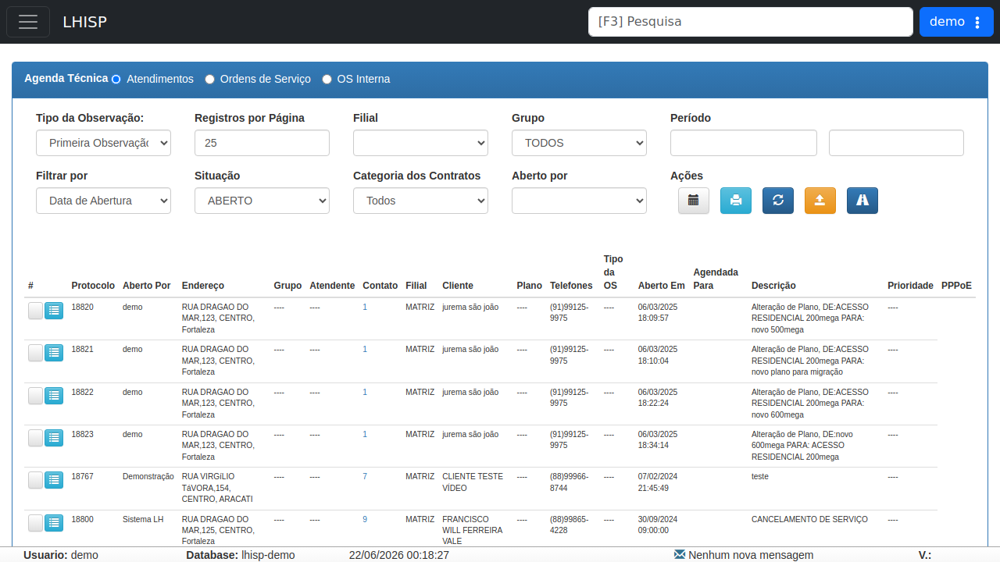

# Agenda Técnica

!!! warning "Rascunho gerado por agente"
    Esta página foi documentada a partir da tela equivalente no ambiente de demonstração do LHISP. A captura utilizada veio do demo e foi mantida sem marcações visuais.

## Objetivo

Acompanhar atendimentos, ordens de serviço e observações técnicas da agenda operacional.

## Quando usar

Use esta tela quando precisar:

- listar atendimentos em aberto ou concluídos;
- filtrar por tipo de observação;
- consultar ordens de serviço internas ou externas;
- acompanhar cliente, protocolo, endereço, prioridade e descrição do atendimento.

## Pré-requisitos

- Estar autenticado no LHISP.
- Ter permissão para acessar o menu **Agenda Técnica**.
- Possuir dados cadastrados para consulta, quando aplicável.

## Passo a passo

1. Acesse o menu **Agenda Técnica**.
2. Escolha o tipo de agenda entre **Atendimentos**, **Ordens de Serviço** ou **OS Interna**.
3. Ajuste filtros como **Tipo da Observação**, **Filial**, **Grupo**, **Período**, **Situação** e **Aberto por**.
4. Revise os dados da listagem.
5. Use os botões de ação para consultar, imprimir, atualizar ou exportar conforme a necessidade do operador.

## Campos importantes

| Campo / ação | Descrição |
|---|---|
| **Tipo da Observação** | Define o tipo de atendimento ou comentário exibido. |
| **Registros por Página** | Controla a quantidade de linhas exibidas por consulta. |
| **Filial** | Filtra atendimentos por unidade. |
| **Grupo** | Filtra por grupo operacional. |
| **Período** | Define o intervalo de consulta. |
| **Filtrar por** | Permite escolher o critério temporal usado na busca. |
| **Situação** | Mostra o status dos registros, como **ABERTO**. |
| **Categoria dos Contratos** | Restringe os resultados por categoria contratual. |
| **Aberto por** | Filtra o usuário responsável pela abertura. |
| **Ações** | Conjunto de botões para consulta, impressão, atualização e exportação. |
| **Listagem** | Grade com protocolo, endereço, cliente, plano, telefones, tipo de OS, descrição e prioridade. |

## Resultado esperado

- A agenda exibe os atendimentos filtrados corretamente.
- O usuário visualiza os protocolos, clientes e descrições relacionados.
- A tela permite acompanhar o andamento das atividades técnicas.

## Problemas comuns

| Problema | Como tratar |
|---|---|
| Nenhum atendimento aparece | Verifique filial, período e situação escolhidos. |
| Os filtros não retornam o esperado | Confirme se a observação e o tipo de agenda estão corretos. |
| A listagem parece incompleta | Ajuste o número de registros por página. |

## Observações

- O demo apresenta a tela com várias linhas de exemplo, mostrando protocolos, clientes, telefones e descrições.
- A interface usa abas para separar **Atendimentos**, **Ordens de Serviço** e **OS Interna**.
- A captura usada nesta página veio do ambiente de demonstração.

## Dúvidas para revisão

- Qual é a diferença operacional entre **Atendimentos**, **Ordens de Serviço** e **OS Interna**?
- Os ícones da barra de ações têm algum comportamento adicional que deva ser descrito?
- A coluna **Tipo da OS** deve ser detalhada com exemplos reais do fluxo?

## Screenshots sugeridos

- Tela **Agenda Técnica** no demo: `docs/assets/screenshots/agenda-tecnica/agenda-tecnica.png`

