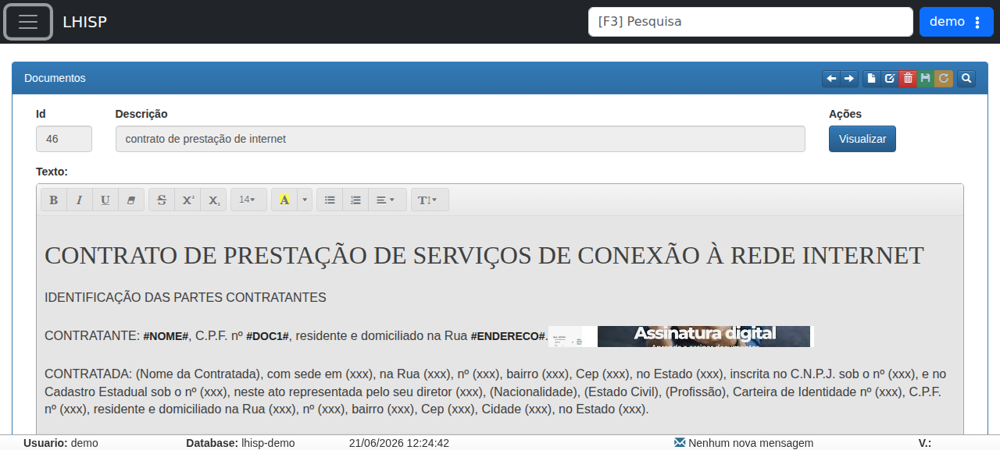

# Documentos

!!! warning "Rascunho gerado por agente"
    Este documento foi produzido a partir da exploração da wiki do LHISP e da tela equivalente no ambiente de demonstração. Modelos de texto, campos dinâmicos e conteúdo jurídico devem ser validados pela equipe técnica antes de qualquer uso em produção.

## Objetivo

Cadastrar e manter **modelos de documentos** que serão preenchidos automaticamente com dados do cliente, da empresa ou do contrato no momento da impressão.

## Quando usar

Use este fluxo quando for necessário:

- criar um novo modelo de documento;
- editar um modelo já existente;
- manter textos jurídicos ou operacionais padronizados;
- reutilizar campos dinâmicos em contratos, cartas de cobrança, anexos e outros impressos.

## Pré-requisitos

- Acesso ao menu **Cadastros > Administrativo > Documentos**.
- Permissão para criar e editar modelos.
- Conhecimento do conteúdo que será impresso.
- Definição dos campos dinâmicos que serão usados no texto.

## Passo a passo

1. Acesse **Cadastros > Administrativo > Documentos**.
2. Clique em **Novo** para criar um modelo ou selecione um registro existente para edição.
3. Preencha a **Descrição** do documento.
4. Escreva ou ajuste o texto do modelo no editor rico.
5. Use os **Campos Dinâmicos** para inserir substituições automáticas do sistema.
6. Clique em **Salvar** quando terminar.
7. Use **Visualizar** para conferir a aparência final do documento.

## Campos importantes

| Campo / ação | Descrição |
|---|---|
| **Id** | Identificador do modelo de documento. |
| **Descrição** | Nome do modelo apresentado ao usuário. |
| **Texto** | Conteúdo principal do documento, editado em um editor rico. |
| **Visualizar** | Mostra uma prévia do documento. |
| **Novo** | Inicia o cadastro de um novo modelo. |
| **Editar** | Abre um modelo existente para alteração. |
| **Apagar** | Remove o modelo selecionado. |
| **Salvar** | Persiste as alterações. |

### Campos dinâmicos observados na wiki

A wiki divide os campos dinâmicos em grupos, como:

- **Empresa**
- **Endereço**
- **Contrato**

Esses grupos alimentam o texto com dados do cadastro correspondente no momento da impressão.

## Resultado esperado

- O modelo de documento fica salvo no sistema.
- A pré-visualização mostra o texto formatado com os campos dinâmicos.
- O documento passa a estar disponível para uso em contratos e outros fluxos de impressão.

## Problemas comuns

| Problema | Como tratar |
|---|---|
| O documento não salva | Verifique se a descrição foi preenchida e se houve alteração válida no texto. |
| Os campos dinâmicos não são substituídos | Confirme se os códigos foram usados exatamente como a wiki descreve. |
| A visualização fica desformatada | Revise a estrutura do texto no editor rico. |
| O modelo aparece incorreto no contrato | Reabra o cadastro e valide o conteúdo salvo. |

## Observações

- A wiki descreve este cadastro como uma ferramenta para agilizar a emissão de contratos, cartas de cobrança e anexos.
- O conteúdo do documento pode usar códigos substituídos dinamicamente pelo sistema.
- O demo exibe um modelo já existente, com a descrição **contrato de prestação de internet**.
- A captura usada nesta página veio do ambiente de demonstração, não da wiki.

## Dúvidas para revisão

- Existe algum conjunto oficial de códigos dinâmicos suportados?
- O modelo de documento é versionado ou sobrescrito a cada edição?
- Há permissões separadas para criar, editar e excluir modelos?
- O botão **Visualizar** gera exatamente o mesmo layout da impressão final?

## Screenshots sugeridos

- Tela **Documentos** no demo: `docs/assets/screenshots/cadastros/administrativo/documentos.png`

