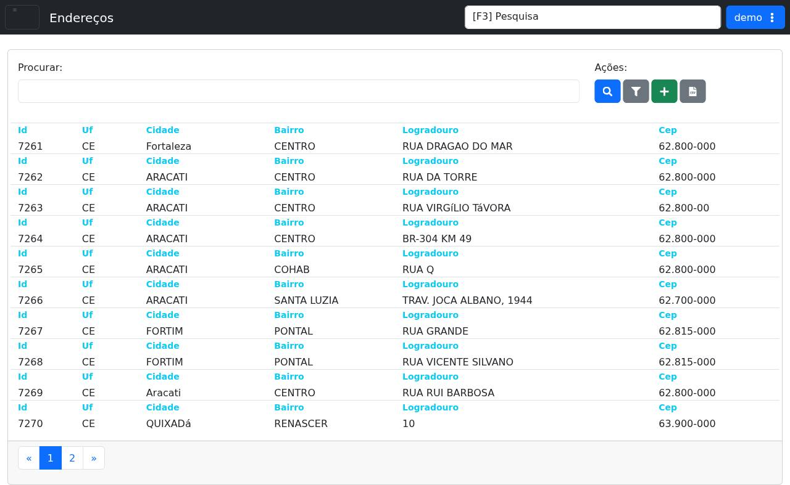

# Endereços

!!! warning "Rascunho gerado por agente"
    Esta página foi documentada a partir da tela equivalente no ambiente de demonstração do LHISP. A captura utilizada veio do demo e foi mantida sem marcações visuais.

## Objetivo

Consultar e manter o cadastro de endereços no LHISP, com busca por registros já existentes, inclusão de novos itens e exportação da listagem.

## Quando usar

Use esta tela quando precisar:

- localizar um endereço cadastrado;
- revisar dados de cidade, bairro, logradouro e CEP;
- incluir um novo endereço no cadastro;
- exportar a listagem para planilha;
- aplicar filtros na relação exibida.

## Pré-requisitos

- Estar autenticado no LHISP.
- Ter permissão para acessar o menu **Cadastros > Administrativo > Endereços**.
- Possuir os dados do endereço a ser consultado ou incluído.

## Passo a passo

1. Acesse o menu **Cadastros > Administrativo > Endereços**.
2. Use o campo **Procurar** para buscar registros existentes, se necessário.
3. Clique em **Procurar** para executar a pesquisa.
4. Clique em **Aplicar Filtros** para refinar a listagem.
5. Clique em **Cadastrar** para iniciar um novo cadastro de endereço.
6. Clique em **Baixar Planilha** para exportar os registros listados.
7. Selecione um item da lista para consultar os dados detalhados do endereço.

## Campos importantes

| Campo / ação | Descrição |
|---|---|
| **Procurar** | Campo de busca textual para localizar registros. |
| **Botão Procurar** | Executa a pesquisa com o termo informado. |
| **Aplicar Filtros** | Abre ou aplica critérios adicionais de filtragem. |
| **Cadastrar** | Inicia a inclusão de um novo endereço. |
| **Baixar Planilha** | Exporta a listagem para planilha. |
| **Id** | Identificador interno do endereço. |
| **Uf** | Unidade federativa cadastrada. |
| **Cidade** | Cidade do endereço. |
| **Bairro** | Bairro associado ao registro. |
| **Logradouro** | Nome da rua, avenida ou via cadastrada. |
| **Cep** | Código postal do endereço. |
| **Paginação** | Controles para navegar entre páginas da listagem. |

## Resultado esperado

- A listagem de endereços fica disponível para consulta.
- O operador consegue filtrar e pesquisar registros rapidamente.
- Novos endereços podem ser incluídos a partir da própria tela.

## Problemas comuns

| Problema | Como tratar |
|---|---|
| A lista não mostra resultados | Revise os filtros aplicados e o termo usado em **Procurar**. |
| O cadastro não aparece | Confirme a permissão do usuário para acessar o menu. |
| A exportação não funciona | Verifique se o perfil possui permissão para baixar a planilha. |
| O registro não abre | Selecione outra linha da listagem ou recarregue a página. |

## Observações

- O demo expõe **Endereços** como uma tela de listagem com busca, filtros, inclusão e exportação.
- A rota confirmada no demo é `/cadastros/administrativo/enderecos`.
- A captura usada nesta página veio do ambiente de demonstração e mostra a listagem principal com a barra de ações visível.

## Dúvidas para revisão

- O botão **Cadastrar** abre um formulário completo ou um modal de inclusão rápida?
- **Aplicar Filtros** possui critérios além dos visíveis na listagem inicial?
- Há alguma regra de validação específica para CEP, UF e cidade no cadastro?
- O botão **Baixar Planilha** exporta exatamente os filtros aplicados?

## Screenshots sugeridos

- Tela **Endereços** no demo: `docs/assets/screenshots/cadastros/administrativo/enderecos.png`

