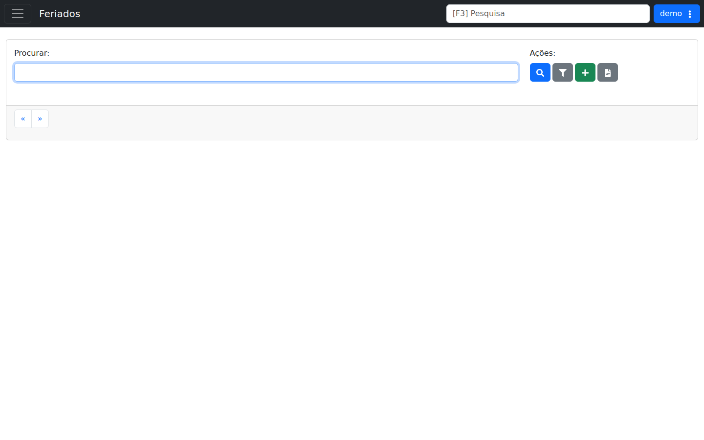

# Feriados

!!! warning "Rascunho gerado por agente"
    Esta página foi documentada a partir da tela equivalente no ambiente de demonstração do LHISP. A captura utilizada veio do demo e foi mantida sem marcações visuais.

## Objetivo

Consultar, cadastrar e administrar feriados usados pelo sistema para regras de atendimento, agendamento e operação.

## Quando usar

Use esta tela quando precisar:

- localizar um feriado já cadastrado;
- cadastrar um novo feriado;
- aplicar filtros de pesquisa;
- exportar a listagem para planilha;
- navegar entre páginas de resultados.

## Pré-requisitos

- Estar autenticado no LHISP.
- Ter permissão para acessar o menu **Cadastros > Administrativo > Feriados**.
- Saber qual data ou descrição do feriado será pesquisada ou cadastrada.

## Passo a passo

1. Acesse **Cadastros > Administrativo > Feriados**.
2. Use o campo **Procurar** para localizar feriados já existentes.
3. Clique em **Procurar** para executar a busca.
4. Use **Aplicar Filtros** quando precisar refinar a listagem.
5. Clique em **Cadastrar** para iniciar um novo registro.
6. Use **Baixar Planilha** para exportar os dados exibidos.
7. Navegue pelas páginas com os controles de paginação no rodapé da área de listagem.

## Campos importantes

| Campo / ação | Descrição |
|---|---|
| **Campo Procurar** | Campo de busca textual para localizar feriados. |
| **Botão Procurar** | Executa a consulta com o termo digitado. |
| **Aplicar Filtros** | Abre ou aplica filtros adicionais da listagem. |
| **Cadastrar** | Inicia o cadastro de um novo feriado. |
| **Baixar Planilha** | Exporta a listagem em arquivo de planilha. |
| **First / Last** | Navegação entre páginas de registros. |

## Resultado esperado

- A listagem mostra os feriados cadastrados ou nenhum resultado quando não há itens correspondentes.
- O operador consegue aplicar filtros, cadastrar novos itens e exportar os dados exibidos.

## Problemas comuns

| Problema | Como tratar |
|---|---|
| Não encontro o feriado desejado | Refine a pesquisa usando o nome ou a data. |
| A lista parece vazia | Verifique se há filtros ativos ou se nenhum feriado está cadastrado. |
| O botão de cadastro não abre | Confirme permissões e se a sessão do usuário está ativa. |
| A exportação não gera arquivo | Refaça a busca e tente novamente com a listagem carregada. |

## Observações

- O demo exibe **Feriados** como uma tela de listagem e pesquisa, não como formulário direto.
- A área principal mostra um campo de busca, ações de pesquisa/filtro/cadastro/exportação e navegação de páginas.
- No momento da captura não havia linhas de resultado visíveis na grade.
- A captura usada nesta página veio do ambiente de demonstração.

## Dúvidas para revisão

- O botão **Aplicar Filtros** abre um painel adicional ou apenas reexecuta a pesquisa?
- O cadastro exige apenas data e descrição, ou existem outros campos obrigatórios?
- A exportação considera todos os registros ou apenas a página atual?
- Há algum comportamento especial para feriados recorrentes?

## Screenshots sugeridos

- Tela **Feriados** no demo: `docs/assets/screenshots/cadastros/administrativo/feriados.png`

