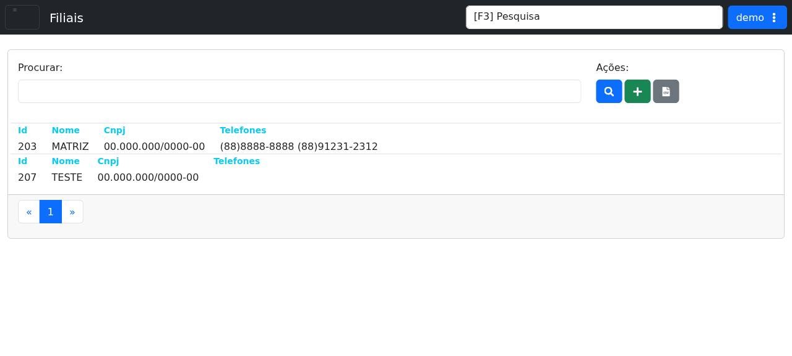

# Filiais

!!! warning "Rascunho gerado por agente"
    Esta página foi documentada a partir da tela equivalente no ambiente de demonstração do LHISP. A captura utilizada veio do demo e foi mantida sem marcações visuais.

## Objetivo

Consultar e manter o cadastro de filiais no LHISP, com pesquisa na listagem, inclusão de novas filiais e exportação dos registros exibidos.

## Quando usar

Use esta tela quando precisar:

- localizar uma filial já cadastrada;
- revisar dados de nome, CNPJ e telefones;
- incluir uma nova filial;
- exportar a relação para planilha;
- navegar pela listagem existente.

## Pré-requisitos

- Estar autenticado no LHISP.
- Ter permissão para acessar o menu **Cadastros > Administrativo > Filiais**.
- Possuir os dados da filial a ser consultada ou incluída.

## Passo a passo

1. Acesse o menu **Cadastros > Administrativo > Filiais**.
2. Use o campo **Procurar** para buscar registros existentes, se necessário.
3. Clique em **Procurar** para executar a pesquisa.
4. Clique em **Cadastrar** para iniciar uma nova filial.
5. Clique em **Baixar Planilha** para exportar a relação exibida.
6. Selecione um item da lista para revisar as informações da filial.

## Campos importantes

| Campo / ação | Descrição |
|---|---|
| **Procurar** | Campo de busca textual para localizar registros. |
| **Botão Procurar** | Executa a pesquisa com o termo informado. |
| **Cadastrar** | Inicia a inclusão de uma nova filial. |
| **Baixar Planilha** | Exporta a listagem para planilha. |
| **Id** | Identificador interno da filial. |
| **Nome** | Nome da filial. |
| **Cnpj** | CNPJ cadastrado para a filial. |
| **Telefones** | Telefones associados ao registro. |
| **Paginação** | Controles para navegar entre páginas da listagem. |

## Resultado esperado

- A listagem de filiais fica disponível para consulta.
- O operador consegue buscar e revisar os dados básicos de cada filial.
- Novas filiais podem ser incluídas a partir da própria tela.

## Problemas comuns

| Problema | Como tratar |
|---|---|
| A lista não mostra resultados | Revise os filtros aplicados e o termo usado em **Procurar**. |
| O cadastro não aparece | Confirme a permissão do usuário para acessar o menu. |
| A exportação não funciona | Verifique se o perfil possui permissão para baixar a planilha. |
| O registro não abre | Selecione outra linha da listagem ou recarregue a página. |

## Observações

- O demo expõe **Filiais** como uma tela de listagem com busca, cadastro e exportação.
- A rota confirmada no demo é `/cadastros/administrativo/filiais`.
- A listagem inicial do demo mostra a filial **MATRIZ** e um registro adicional de teste.
- A captura usada nesta página veio do ambiente de demonstração e mostra a lista principal com as ações visíveis.

## Dúvidas para revisão

- O botão **Cadastrar** abre um formulário completo ou um modal simplificado?
- O cadastro de filial exige CNPJ válido em todos os cenários?
- Há validações específicas para os telefones exibidos na listagem?
- O botão **Baixar Planilha** exporta exatamente os filtros aplicados?

## Screenshots sugeridos

- Tela **Filiais** no demo: `docs/assets/screenshots/cadastros/administrativo/filiais.png`

