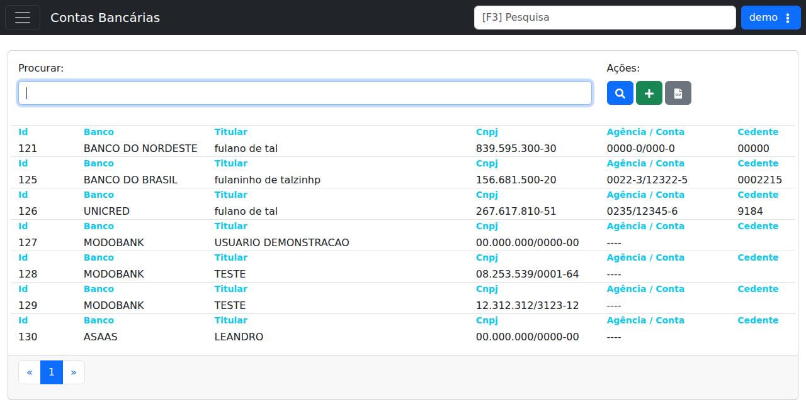

# Contas Bancárias

## Objetivo

Documentar a tela de listagem e cadastro de **Contas Bancárias** em **Cadastros > Financeiro > Contas Bancárias**.

## Quando usar

Use esta tela quando for necessário:

- consultar as contas bancárias cadastradas;
- cadastrar uma nova conta bancária;
- localizar uma conta pelo campo de busca;
- exportar a listagem para planilha.

## Pré-requisitos

- Acesso ao menu **Cadastros > Financeiro > Contas Bancárias**.
- Permissão para consultar e cadastrar registros financeiros.

## Passo a passo

1. Acesse **Cadastros > Financeiro > Contas Bancárias**.
2. Use o campo **Procurar** para filtrar a listagem, se necessário.
3. Clique em **Procurar** para executar a busca.
4. Clique em **Cadastrar** para criar uma nova conta bancária.
5. Clique em **Baixar Planilha** para exportar a lista exibida.
6. Clique em um item da listagem para abrir o cadastro correspondente.

## Campos importantes

| Campo / ação | Descrição |
|---|---|
| Campo **Procurar** | Campo de filtro para localizar contas bancárias na listagem. |
| Botão **Procurar** | Executa a busca com o termo digitado. |
| **Cadastrar** | Abre o fluxo de inclusão de uma nova conta bancária. |
| **Baixar Planilha** | Exporta a listagem atual para arquivo de planilha. |
| **Id** | Identificador da conta bancária. |
| **Banco** | Nome do banco cadastrado. |
| **Titular** | Nome do titular da conta. |
| **Cnpj** | Documento vinculado ao cadastro. |
| **Agência / Conta** | Número da agência e da conta exibido na listagem. |
| **Cedente** | Código de cedente exibido no cadastro. |

## Resultado esperado

- A lista de contas bancárias fica visível com paginação.
- O usuário consegue abrir uma conta existente para consulta ou edição.
- O usuário consegue iniciar o cadastro de uma nova conta bancária.

## Problemas comuns

| Problema | Como tratar |
|---|---|
| Nenhum resultado aparece | Verifique o termo informado no campo **Procurar**. |
| Registro não abre | Confirme se o usuário possui permissão para consultar o item. |
| Exportação não baixa | Refaça a ação em uma página com resultados carregados. |

## Observações

- A tela verificada no demo mostra a rota `/cadastros/financeiro/contas_bancarias`.
- Na listagem do demo, foram observados registros como **BANCO DO NORDESTE**, **BANCO DO BRASIL**, **UNICRED**, **MODOBANK** e **ASAAS**.
- A tela é objetiva e funciona como uma listagem administrativa simples.

## Dúvidas para revisão

- Existe alguma regra específica de uso para cada conta bancária cadastrada?
- O fluxo de cadastro possui campos adicionais que não aparecem na listagem?
- O sistema exige algum vínculo com contratos ou boletos ao criar uma nova conta?

## Screenshots sugeridos

- `docs/assets/screenshots/cadastros/financeiro/contas-bancarias.png` — captura limpa da listagem de contas bancárias no demo.

## Captura do demo

