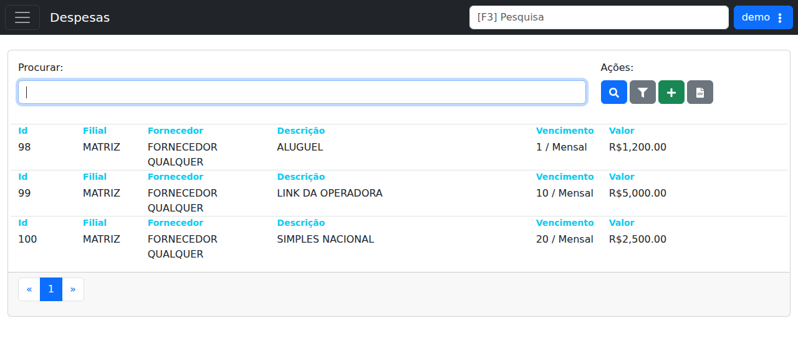

# Despesas

## Objetivo

Documentar a tela de listagem e cadastro de **Despesas** em **Cadastros > Financeiro > Despesas**.

## Quando usar

Use esta tela quando for necessário:

- consultar despesas cadastradas;
- cadastrar uma nova despesa;
- filtrar registros por texto;
- aplicar filtros adicionais antes da busca;
- exportar a listagem para planilha.

## Pré-requisitos

- Acesso ao menu **Cadastros > Financeiro > Despesas**.
- Permissão para consultar e cadastrar registros financeiros.

## Passo a passo

1. Acesse **Cadastros > Financeiro > Despesas**.
2. Use o campo **Procurar** para filtrar a listagem, se necessário.
3. Clique em **Aplicar Filtros** quando houver critérios adicionais.
4. Clique em **Procurar** para executar a busca.
5. Clique em **Cadastrar** para criar uma nova despesa.
6. Clique em **Baixar Planilha** para exportar a lista exibida.
7. Clique em um item da listagem para abrir o registro correspondente.

## Campos importantes

| Campo / ação | Descrição |
|---|---|
| Campo **Procurar** | Campo de filtro textual da listagem. |
| **Aplicar Filtros** | Aplica os filtros adicionais disponíveis na tela. |
| **Procurar** | Executa a pesquisa com os critérios informados. |
| **Cadastrar** | Inicia o fluxo de inclusão de uma nova despesa. |
| **Baixar Planilha** | Exporta a listagem atual para arquivo de planilha. |
| **Id** | Identificador da despesa. |
| **Filial** | Filial vinculada ao registro. |
| **Fornecedor** | Fornecedor associado à despesa. |
| **Descrição** | Texto resumido da despesa. |
| **Vencimento** | Período ou data de vencimento exibida na listagem. |
| **Valor** | Valor monetário da despesa. |

## Resultado esperado

- A lista de despesas fica visível com paginação.
- O usuário consegue abrir uma despesa existente para consulta ou edição.
- O usuário consegue iniciar o cadastro de uma nova despesa.

## Problemas comuns

| Problema | Como tratar |
|---|---|
| Nenhum resultado aparece | Verifique o termo informado no campo **Procurar**. |
| Filtros não mudam a lista | Clique em **Aplicar Filtros** antes de buscar novamente. |
| Exportação não baixa | Refaça a ação com a listagem já carregada. |

## Observações

- A tela verificada no demo mostra a rota `/cadastros/financeiro/despesas`.
- Na listagem do demo, foram observadas despesas como **ALUGUEL**, **LINK DA OPERADORA** e **SIMPLES NACIONAL**.
- A listagem aparece com a filial **MATRIZ** e valores em reais.

## Dúvidas para revisão

- O campo **Vencimento** representa data, recorrência mensal ou outra regra?
- Existem filtros adicionais que não ficaram evidentes na tela do demo?
- A despesa pode ser vinculada a mais de um fornecedor ou filial?

## Screenshots sugeridos

- `docs/assets/screenshots/cadastros/financeiro/despesas.png` — captura limpa da listagem de despesas no demo.

## Captura do demo

