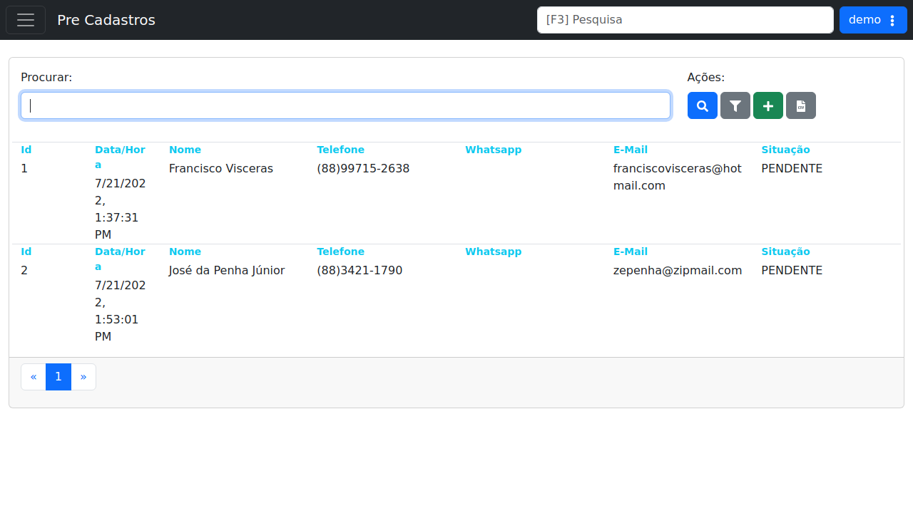

# Pre Cadastros

!!! warning "Rascunho gerado por agente"
    Esta página foi documentada a partir da tela equivalente no ambiente de demonstração do LHISP. A captura utilizada veio do demo e foi mantida sem marcações visuais.

## Objetivo

Acompanhar e gerenciar os pré-cadastros recebidos no sistema, com dados básicos de contato, data/hora de solicitação e situação de cada registro.

## Quando usar

Use esta tela quando precisar:

- consultar solicitações de pré-cadastro;
- localizar um registro específico pelo nome ou outro critério de busca;
- cadastrar um novo pré-cadastro;
- aplicar filtros na lista exibida;
- exportar a relação para planilha.

## Pré-requisitos

- Estar autenticado no LHISP.
- Ter permissão para acessar o menu **Cadastros > Pre Cadastros**.
- Possuir os dados do prospect ou cliente a ser incluído.

## Passo a passo

1. Acesse o menu **Cadastros > Pre Cadastros**.
2. Use o campo **Procurar** para localizar um registro existente.
3. Clique em **Procurar** para executar a pesquisa.
4. Clique em **Aplicar Filtros** para refinar a listagem, se necessário.
5. Clique em **Cadastrar** para incluir um novo pré-cadastro.
6. Use **Baixar Planilha** para exportar os itens listados.
7. Selecione um registro na lista para revisar os dados exibidos.

## Campos importantes

| Campo / ação | Descrição |
|---|---|
| **Campo Procurar** | Campo de texto para busca rápida. |
| **Botão Procurar** | Executa a pesquisa com o termo informado. |
| **Aplicar Filtros** | Abre ou aplica critérios adicionais de filtragem. |
| **Cadastrar** | Inicia o cadastro de um novo pré-cadastro. |
| **Baixar Planilha** | Exporta a listagem para planilha. |
| **Id** | Identificador do pré-cadastro. |
| **Data/Hora** | Momento em que o registro foi criado. |
| **Nome** | Nome do solicitante. |
| **Telefone** | Telefone principal do contato. |
| **Whatsapp** | Indica a presença de vínculo com WhatsApp. |
| **E-Mail** | Endereço eletrônico do contato. |
| **Situação** | Status atual do pré-cadastro. |

## Resultado esperado

- O usuário consegue visualizar a lista de pré-cadastros.
- A busca e os filtros ajudam a localizar registros rapidamente.
- Novos pré-cadastros podem ser incluídos pela própria tela.

## Problemas comuns

| Problema | Como tratar |
|---|---|
| A lista não mostra registros | Verifique se há dados cadastrados e ajuste os filtros. |
| A busca não retorna nada | Revise o texto digitado em **Procurar**. |
| A exportação falha | Confirme se há permissão para baixar a planilha. |
| O botão cadastrar não aparece | Verifique permissões do usuário. |

## Observações

- A tela do demo aparece como **Pre Cadastros** na barra superior.
- A listagem mostra registros com situação **PENDENTE** no ambiente de demonstração.
- A interface possui ações diretas de busca, filtro, cadastro e exportação.
- A captura usada nesta página veio do ambiente de demonstração.

## Dúvidas para revisão

- O fluxo de **Cadastrar** cria apenas um pré-cadastro ou já inicia um atendimento completo?
- A coluna **Whatsapp** indica apenas presença de número ou um status de integração?
- A exportação da planilha respeita os mesmos filtros da listagem?
- A situação **PENDENTE** possui outros estados possíveis além dos exibidos no demo?

## Screenshots sugeridos

- Tela **Pre Cadastros** no demo: `docs/assets/screenshots/cadastros/pre-cadastros.png`

