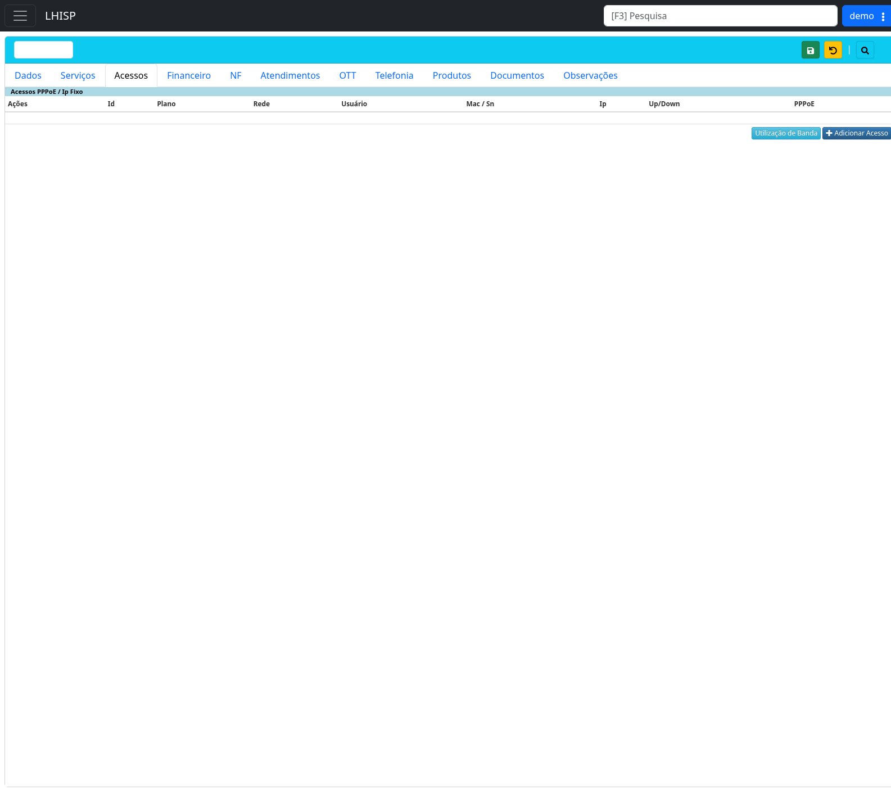

# Adicionar um acesso ao cliente

!!! warning "Rascunho gerado por agente"
    Este documento foi elaborado a partir de exploração no ambiente de demonstração. Revise os campos técnicos e regras de provisionamento antes de publicar.

## Objetivo

Adicionar um acesso técnico ao cliente/contrato, como **PPPoE** ou **IP Fixo**, vinculando o acesso ao plano/rede correspondente.

## Quando usar

Use este fluxo após cadastrar o cliente e adicionar o serviço contratado, quando o cliente precisar de credenciais, IP, rede ou configuração de autenticação para uso do serviço.

## Pré-requisitos

- Cliente/contrato salvo.
- Serviço contratado vinculado ao contrato.
- Rede/infraestrutura disponível para o acesso.
- Plano compatível com o tipo de acesso.
- Usuário com permissão para criar/alterar acessos.
- Usar apenas dados fictícios no ambiente demo.

## Passo a passo

1. Acesse **Contratos**.
2. Abra o contrato do cliente.
3. Clique na aba **Acessos**.
4. Localize a seção **Acessos PPPoE / IP Fixo**.
5. Revise a lista de acessos existentes.
6. Clique em **+ Adicionar Acesso**.
7. Preencha os dados técnicos solicitados pelo formulário de inclusão.
8. Informe plano, rede e usuário de autenticação conforme a política operacional.
9. Informe MAC/SN ou IP quando aplicável ao tipo de acesso.
10. Salve o acesso.
11. Confirme se o novo acesso aparece na tabela da aba **Acessos**.
12. Quando necessário, use **Utilização de Banda** para consultar tráfego ou consumo do acesso.

## Campos importantes

A aba **Acessos** apresenta a tabela **Acessos PPPoE / IP Fixo** com as colunas observadas:

| Campo/coluna | Descrição |
|---|---|
| **Ações** | Ações por acesso listado. Confirmar quais ações são seguras para documentação. |
| **Id** | Identificador interno do acesso. |
| **Plano** | Plano associado ao acesso. |
| **Rede** | Rede ou infraestrutura utilizada. |
| **Usuário** | Usuário de autenticação, provavelmente PPPoE. |
| **Mac / SN** | MAC address ou número de série do equipamento. |
| **IP** | Endereço IP associado ao acesso, quando aplicável. |
| **Up/Down** | Velocidade ou perfil de banda de upload/download. Confirmar formato. |
| **PPPoE** | Indicador/dados de PPPoE. Confirmar significado exato. |

## Resultado esperado

- O acesso fica vinculado ao contrato do cliente.
- A tabela da aba **Acessos** passa a exibir o novo registro.
- O acesso pode ser usado para autenticação, provisionamento ou acompanhamento técnico.

## Problemas comuns

| Problema | Como tratar |
|---|---|
| Botão **Adicionar Acesso** não aparece | Confirme se o contrato foi salvo e se há permissão adequada. |
| Plano não listado | Confirme se existe serviço contratado compatível. |
| Usuário PPPoE duplicado | Use padrão único definido pela operação e valide disponibilidade. |
| IP indisponível | Verifique rede/faixa configurada antes de salvar. |
| MAC/SN inválido | Confirme formato exigido e se o campo é obrigatório para o tipo de acesso. |
| Acesso não aparece após salvar | Atualize a aba ou reabra o contrato. |

## Observações

- A aba possui botão **Utilização de Banda**, provavelmente para análise de consumo/tráfego.
- A tela observada não exibiu registros de acesso carregados no momento da captura.
- Evite qualquer ação de bloqueio, cancelamento ou remoção em acessos durante testes de documentação.
- Cadastros técnicos devem seguir padrões definidos pela operação de rede.

## Dúvidas para revisão

- Quais tipos de acesso o LHISP aceita nessa aba além de PPPoE e IP Fixo?
- O acesso exige serviço contratado previamente ativo?
- O sistema gera automaticamente usuário/senha PPPoE?
- O campo **Up/Down** vem do plano ou pode ser editado no acesso?
- A seleção de rede reserva IP automaticamente?
- Quais ações aparecem na coluna **Ações** quando há acesso cadastrado?
- O botão **Utilização de Banda** exige selecionar um acesso?

## Screenshots sugeridos

- Aba **Acessos** do contrato: `docs/assets/screenshots/contratos/acessos-aba.png`

