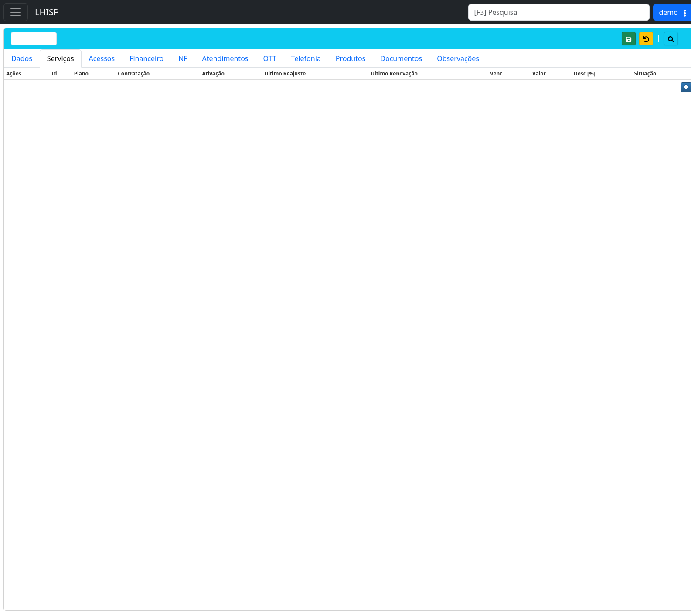

# Adicionar um serviço contratado

!!! warning "Rascunho gerado por agente"
    Este documento foi elaborado a partir de exploração no ambiente de demonstração. O formulário de inclusão não foi confirmado até o salvamento para evitar alterações indevidas; revise as regras antes de publicar.

## Objetivo

Adicionar um serviço/plano contratado a um cliente dentro do cadastro de **Contratos**.

## Quando usar

Use este fluxo depois que o cliente/contrato já estiver cadastrado e salvo, quando for necessário vincular um plano de serviço ao contrato.

## Pré-requisitos

- Cliente/contrato criado e salvo.
- Plano previamente cadastrado no LHISP.
- Filial e categoria compatíveis com o plano escolhido.
- Dados fictícios quando estiver no tenant de demonstração.
- Permissão para alterar contratos e serviços contratados.

## Passo a passo

1. Acesse **Contratos**.
2. Localize e abra o contrato do cliente.
3. Clique na aba **Serviços**.
4. Verifique a grade de serviços contratados já existentes.
5. Clique no botão azul com ícone de **+** no canto direito da grade.
6. No formulário ou modal de inclusão, informe os dados do serviço contratado.
7. Revise datas, valores e situação do serviço.
8. Confirme a inclusão do serviço.
9. Clique no botão de **salvar** da tela, se o sistema exigir salvamento global.
10. Verifique se o novo serviço aparece na tabela da aba **Serviços**.

## Campos importantes

A aba **Serviços** apresenta uma tabela com as seguintes colunas observadas:

| Campo/coluna | Descrição |
|---|---|
| **Ações** | Ações por serviço listado, como edição/visualização. Não foi validado se inclui exclusão. |
| **Id** | Identificador interno do serviço contratado. |
| **Plano** | Plano ou serviço vinculado ao contrato. |
| **Contratação** | Data de contratação do serviço. |
| **Ativação** | Data de ativação do serviço. |
| **Último Reajuste** | Data do último reajuste aplicado. |
| **Última Renovação** | Data de renovação do vínculo. Na tela foi observado texto semelhante a `Ultimo Renovação`. |
| **Venc.** | Vencimento relacionado ao serviço/contrato. Confirmar regra exata. |
| **Valor** | Valor contratado do serviço. |
| **Desc [%]** | Desconto percentual aplicado. |
| **Situação** | Status do serviço contratado, como ativo, pendente, cancelado ou bloqueado. Confirmar lista oficial. |

## Resultado esperado

- O serviço contratado fica vinculado ao contrato do cliente.
- A linha do serviço aparece na grade da aba **Serviços**.
- O serviço pode ser usado nas próximas etapas, como cadastro de acesso e geração de cobrança.

## Problemas comuns

| Problema | Como tratar |
|---|---|
| Botão `+` não aparece | Verifique se o contrato foi salvo e se o usuário tem permissão. |
| Plano indisponível | Confirme filial, categoria, tipo de pessoa e cadastro do plano. |
| Valor incorreto | Verifique se o plano possui preço padrão, desconto ou reajuste aplicado. |
| Serviço não aparece após salvar | Atualize a consulta ou reabra o contrato para confirmar persistência. |
| Campos de data recusados | Verifique formato de data e se a data de ativação não viola regra de negócio. |

## Observações

- Na exploração, a aba **Serviços** exibiu uma grade vazia e o botão de adição.
- A documentação do formulário de inclusão depende de revisão funcional, pois o modal/formulário não foi submetido no ambiente demo.
- Não use ações de cancelar, excluir ou bloquear serviços durante testes de documentação.
- Se o serviço controlar velocidade ou acesso, finalize esta etapa antes de cadastrar o acesso do cliente.

## Dúvidas para revisão

- O serviço pode ser adicionado antes de salvar o contrato?
- Quais campos são obrigatórios no formulário de serviço contratado?
- O campo **Venc.** representa vencimento de cobrança, fidelidade ou validade do serviço?
- A situação inicial do serviço deve ser **Pendente** ou **Ativo**?
- A criação do serviço gera contas automaticamente ou a cobrança precisa ser gerada na aba **Financeiro**?
- A coluna **Ações** possui alguma ação destrutiva que deve ser restringida no manual?

## Screenshots sugeridos

- Aba **Serviços** do contrato: `docs/assets/screenshots/contratos/servicos-aba.png`

