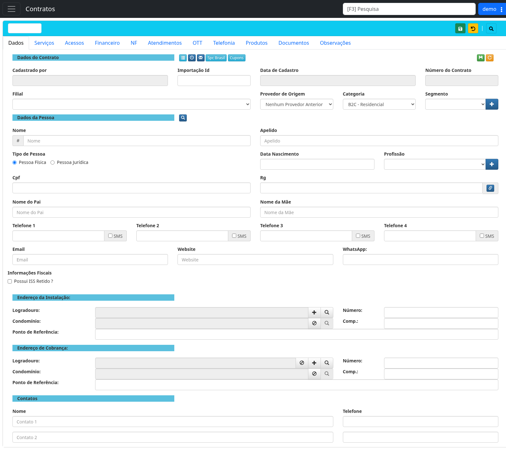

# Cadastrar um novo cliente em Contratos

!!! warning "Rascunho gerado por agente"
    Este documento foi elaborado a partir de exploração no ambiente de demonstração `https://demo.lhprovedor.com.br/`. Revise as regras de negócio antes de publicar como documentação final.

## Objetivo

Cadastrar um novo cliente/contrato no módulo **Contratos**, preenchendo os dados cadastrais, fiscais, endereço de instalação, endereço de cobrança e contatos.

## Quando usar

Use este fluxo quando for necessário registrar um novo cliente no LHISP para, em seguida, vincular serviços contratados, acessos, informações financeiras e demais dados do contrato.

## Pré-requisitos

- Estar autenticado no ambiente de demonstração/staging.
- Ter permissão de acesso ao módulo **Contratos**.
- Utilizar apenas dados fictícios no tenant de demonstração.
- Ter em mãos os dados do cliente, endereço e contatos.
- Não usar este procedimento em produção durante validação documental.

## Passo a passo

1. Acesse o LHISP no ambiente de demonstração.
2. Faça login com usuário autorizado para o tenant demo.
3. Abra o menu lateral e clique em **Contratos**.
4. Na listagem de contratos, clique no botão verde de **novo cadastro** (`+`).
5. Na tela do contrato, mantenha a aba **Dados** selecionada.
6. Preencha a seção **Dados do Contrato**:
   - **Filial**;
   - **Provedor de Origem**, se aplicável;
   - **Categoria**;
   - **Segmento**, se utilizado pela operação.
7. Preencha a seção **Dados da Pessoa**:
   - **Nome**;
   - **Apelido**, se houver;
   - **Tipo de Pessoa**: Pessoa Física ou Pessoa Jurídica;
   - **CPF/CNPJ** conforme o tipo selecionado;
   - **RG/Inscrição**, se aplicável;
   - telefones, e-mail, website e WhatsApp.
8. Em **Informações Fiscais**, marque **Possui ISS Retido?** somente se a regra fiscal do cliente exigir.
9. Preencha o **Endereço da Instalação**:
   - logradouro;
   - número;
   - condomínio, se houver;
   - complemento;
   - ponto de referência.
10. Preencha o **Endereço de Cobrança**. Quando for igual ao endereço de instalação, confirme se o sistema possui recurso de cópia ou preencha manualmente.
11. Preencha os contatos adicionais, se necessário.
12. Clique no botão de **salvar** representado pelo ícone de disquete.
13. Confirme se o contrato foi criado e se as abas **Serviços**, **Acessos** e **Financeiro** ficaram disponíveis para continuidade do cadastro.

## Campos importantes

| Campo | Observação |
|---|---|
| **Filial** | Define a unidade responsável pelo contrato. |
| **Categoria** | Exemplo observado: `B2C - Residencial`. Pode impactar planos e regras comerciais. |
| **Segmento** | Pode exigir cadastro/seleção auxiliar pelo botão `+`. |
| **Tipo de Pessoa** | Altera a natureza do documento exigido: CPF ou CNPJ. |
| **CPF/CNPJ** | Deve ser fictício no ambiente demo. Mascare em prints e documentos públicos. |
| **Telefone / SMS** | Cada telefone possui opção relacionada a SMS. Validar quando usar em produção. |
| **Endereço da Instalação** | Endereço técnico onde o serviço será entregue. |
| **Endereço de Cobrança** | Pode ser diferente do endereço de instalação. |
| **Possui ISS Retido?** | Campo fiscal; deve seguir orientação fiscal/contábil. |

## Resultado esperado

- O cliente/contrato é salvo no módulo **Contratos**.
- O novo contrato passa a permitir inclusão de serviços, acessos e contas financeiras.
- O cadastro aparece na listagem/pesquisa de contratos.

## Problemas comuns

| Problema | Como tratar |
|---|---|
| Botão de salvar não conclui | Verifique campos obrigatórios não preenchidos e mensagens de validação. |
| CPF/CNPJ recusado | Confirme formato e validade do documento fictício usado no ambiente demo. |
| Endereço não localizado | Use os botões de pesquisa/cadastro ao lado de logradouro/condomínio. |
| Segmento ou profissão indisponível | Use o botão `+` apenas se tiver permissão e se o cadastro auxiliar fizer parte do processo. |
| Abas sem dados após salvar | Confirme se o contrato foi realmente salvo e se a tela carregou o número do contrato. |

## Observações

- A tela possui abas para **Dados**, **Serviços**, **Acessos**, **Financeiro**, **NF**, **Atendimentos**, **OTT**, **Telefonia**, **Produtos**, **Documentos** e **Observações**.
- Durante a exploração, os campos foram identificados visualmente; não foram cadastrados dados reais.
- Use nomes como `Cliente Demo Agente`, documentos fictícios e telefones reservados para teste.
- Não clique em ações de exclusão, cancelamento, bloqueio ou remoção durante a validação deste fluxo.

## Dúvidas para revisão

- Quais campos são obrigatórios para salvar o cadastro de Pessoa Física?
- Quais campos são obrigatórios para Pessoa Jurídica?
- O endereço de cobrança pode ser copiado automaticamente do endereço de instalação?
- O campo **Segmento** é obrigatório para todas as categorias?
- O botão amarelo da barra superior representa voltar, desfazer ou recarregar?
- Existe validação automática de CPF/CNPJ ou consulta externa?

## Screenshots sugeridos

- Tela de login: `docs/assets/screenshots/contratos/login.png`
- Menu principal com módulo Contratos: `docs/assets/screenshots/contratos/menu-principal.png`
- Formulário de novo cliente/contrato: `docs/assets/screenshots/contratos/novo-cliente-formulario.png`

