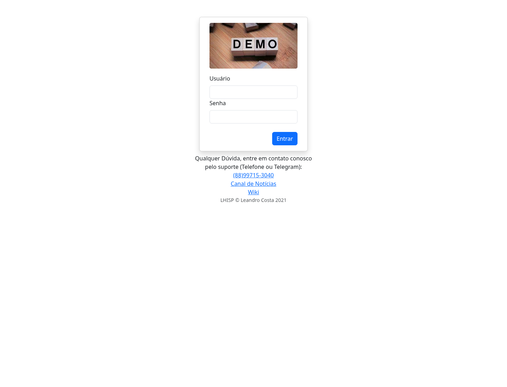
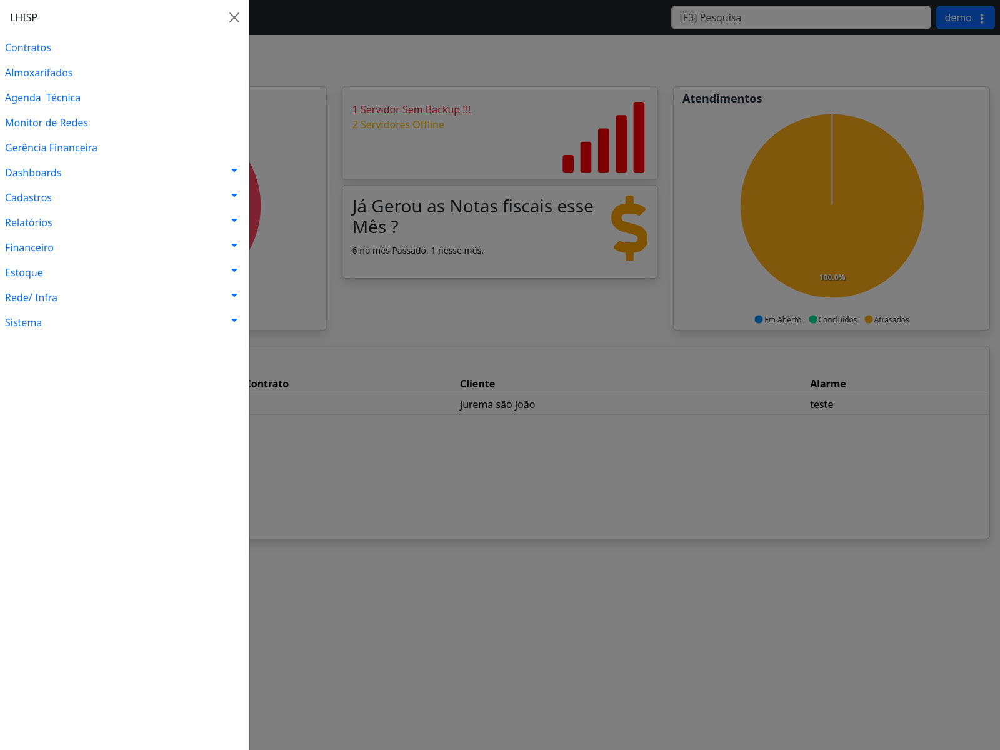

# Cadastrar novo cliente

## Objetivo

Cadastrar um novo cliente e gerar o contrato inicial no módulo **Contratos** do LHISP.

O cadastro cria a pessoa, vincula a filial, define os dados básicos do contrato e registra o endereço de instalação. Após salvar, o contrato fica disponível para continuidade do atendimento nas abas **Serviços**, **Acessos**, **Financeiro**, **NF**, **Atendimentos**, **OTT**, **Telefonia**, **Produtos**, **Documentos** e **Observações**.

## Quando usar

Use este procedimento quando um novo cliente precisa ser registrado no LHISP antes da contratação de serviços, criação de acessos ou geração de contas.

Exemplos de uso:

- inclusão de novo cliente residencial;
- inclusão de novo cliente corporativo;
- cadastro inicial de contrato para posterior ativação de serviços;
- migração de cliente que ainda não possui contrato no LHISP.

## Pré-requisitos

- Estar autenticado no LHISP com usuário autorizado.
- Ter acesso ao módulo **Contratos**.
- Ter a filial correta definida para o cliente.
- Ter os dados cadastrais do cliente.
- Ter o endereço de instalação cadastrado ou saber cadastrá-lo durante o processo.

## Passo a passo

### 1. Abrir o módulo Contratos

1. No menu principal, clique em **Contratos**.
2. A tela exibirá a listagem de contratos existentes.
3. Clique no botão verde de **novo cadastro** (`+`).
4. O sistema abrirá a tela de cadastro com a aba **Dados** selecionada.

### 2. Preencher os dados do contrato

Na seção **Dados do Contrato**, preencha ou confirme:

1. **Filial**: selecione a filial responsável pelo contrato.
2. **Provedor de Origem**: mantenha **Nenhum Provedor Anterior** quando o cliente não veio de outro provedor.
3. **Categoria**: selecione a categoria do contrato, como **B2C - Residencial** ou **B2B - Corporativo**.
4. **Segmento**: selecione o segmento quando aplicável.

Os campos **Cadastrado por**, **Data de Cadastro** e **Número do Contrato** são preenchidos pelo sistema após o salvamento.

### 3. Preencher os dados da pessoa

Na seção **Dados da Pessoa**, informe:

1. **Nome** do cliente.
2. **Apelido**, se houver.
3. **Tipo de Pessoa**:
   - **Pessoa Física** para CPF;
   - **Pessoa Jurídica** para CNPJ.
4. **CPF/CNPJ** no campo de documento.
5. **RG / Inscrição Estadual**, quando aplicável.
6. **Data Nascimento**, quando aplicável.
7. **Profissão**, quando usada pela operação.
8. **Nome do Pai** e **Nome da Mãe**, quando necessário.
9. **Telefone 1**.
10. Demais telefones, e-mail, website e WhatsApp, quando disponíveis.
11. Marque os checkboxes de **SMS** apenas para telefones que podem receber mensagens.

!!! important "Campos obrigatórios"
O salvamento validou como obrigatórios: **Filial**, **Categoria**, **Nome**, **CPF/CNPJ**, **Telefone 1** e **Endereço da Instalação**.

### 4. Preencher informações fiscais

Na seção **Informações Fiscais**, marque **Possui ISS Retido?** somente quando o cliente tiver retenção de ISS conforme a regra fiscal aplicável.

Quando não houver retenção, deixe o campo desmarcado.

### 5. Informar o endereço de instalação

Na seção **Endereço da Instalação**, selecione ou cadastre o endereço onde o serviço será instalado.

1. Clique no botão de **pesquisa** ao lado de **Logradouro** para localizar um endereço existente; ou
2. Clique no botão de **cadastro** (`+`) ao lado de **Logradouro** para criar um novo endereço.
3. Ao cadastrar um novo endereço, informe:
   - **UF**;
   - **Tipo**: Urbano ou Rural;
   - **Cidade**;
   - **Bairro**;
   - **Logradouro**;
   - **CEP**.
4. Depois de selecionar ou cadastrar o endereço, preencha:
   - **Número**;
   - **Condomínio**, se houver;
   - **Complemento**;
   - **Ponto de Referência**.

### 6. Informar o endereço de cobrança

Na seção **Endereço de Cobrança**, informe o endereço usado para cobrança.

1. Se for o mesmo endereço de instalação, selecione o mesmo logradouro.
2. Preencha **Número**, **Complemento** e **Ponto de Referência** conforme necessário.
3. Use os botões de pesquisa ou cadastro quando o endereço ainda não existir.

O endereço de cobrança pode ser diferente do endereço de instalação.

### 7. Informar contatos adicionais

Na seção **Contatos**, registre contatos auxiliares quando existirem.

Campos disponíveis:

- **Contato 1** e telefone;
- **Contato 2** e telefone;
- **Contato 3** e telefone.

Use esses campos para contatos administrativos, técnicos ou responsáveis adicionais.

### 8. Salvar o cadastro

1. Revise os dados preenchidos.
2. Clique no botão **Salvar**, representado pelo ícone de disquete.
3. Aguarde o sistema concluir o processamento.
4. Após salvar, o sistema abre o contrato em modo de visualização/alteração e preenche:
   - **Número do Contrato**;
   - **Data de Cadastro**;
   - **Cadastrado por**.

## Campos importantes

| Campo                      | Descrição                                                                                           |
| -------------------------- | --------------------------------------------------------------------------------------------------- |
| **Filial**                 | Unidade responsável pelo contrato.                                                                  |
| **Categoria**              | Classificação comercial do contrato, como residencial ou corporativo.                               |
| **Segmento**               | Segmentação operacional/comercial do contrato.                                                      |
| **Tipo de Pessoa**         | Define se o documento será tratado como CPF ou CNPJ.                                                |
| **CPF/CNPJ**               | Documento principal da pessoa. O sistema valida CPF para pessoa física e CNPJ para pessoa jurídica. |
| **Telefone 1**             | Telefone principal do cliente. É obrigatório.                                                       |
| **ISS Retido**             | Indica regra fiscal de retenção de ISS.                                                             |
| **Endereço da Instalação** | Endereço técnico onde o serviço será instalado. É obrigatório para salvar.                          |
| **Endereço de Cobrança**   | Endereço usado para cobrança. Pode ser diferente do endereço de instalação.                         |
| **Contatos**               | Contatos adicionais relacionados ao cliente/contrato.                                               |

## Resultado esperado

Após salvar:

- o cliente é cadastrado como pessoa no LHISP;
- o contrato é criado e recebe um número gerado pelo sistema;
- a tela passa a exibir o contrato salvo;
- o cadastro fica disponível para inclusão de serviços, acessos e dados financeiros;
- o contrato pode ser localizado posteriormente na listagem de **Contratos**.

## Problemas comuns

| Problema                                           | Causa provável                                                              | Como resolver                                                                               |
| -------------------------------------------------- | --------------------------------------------------------------------------- | ------------------------------------------------------------------------------------------- |
| **CPF Inválido**                                   | Documento informado não passa na validação de CPF.                          | Corrija o CPF ou altere o tipo para Pessoa Jurídica quando o documento for CNPJ.            |
| **CNPJ Inválido**                                  | Documento informado não passa na validação de CNPJ.                         | Corrija o CNPJ ou altere o tipo para Pessoa Física quando o documento for CPF.              |
| **Endereço da Instalação destacado como inválido** | O logradouro foi digitado sem selecionar/cadastrar endereço interno.        | Use a lupa para pesquisar ou o botão `+` para cadastrar o endereço.                         |
| **Data de Nascimento Inválida**                    | Data preenchida em formato inválido.                                        | Preencha a data em formato aceito pelo campo ou deixe em branco quando não for obrigatória. |
| **Contrato não salva ao clicar no disquete**       | Algum campo obrigatório está vazio ou inválido.                             | Revise Filial, Categoria, Nome, CPF/CNPJ, Telefone 1 e Endereço da Instalação.              |
| **Endereço de cobrança incorreto**                 | Endereço de cobrança diferente do endereço de instalação não foi conferido. | Revise a seção **Endereço de Cobrança** antes de salvar.                                    |

## Observações

- O botão **Spc Brasil** fica disponível na seção **Dados do Contrato** para consultas relacionadas a crédito, conforme permissões e integrações configuradas.
- O botão **Cupons** fica disponível para vínculo ou consulta de cupons de desconto, conforme configuração do sistema.
- O botão de cadastro (`+`) ao lado de **Segmento** permite cadastrar segmento quando necessário.
- O botão de cadastro (`+`) ao lado de **Profissão** permite cadastrar profissão quando necessário.
- O cadastro de endereço possui o campo **Tipo**, com opções **Urbano** e **Rural**.
- A validação feita no ambiente demo confirmou que o contrato é criado com situação inicial pendente até a continuidade do fluxo operacional.

## Dúvidas para revisão

- Confirmar se **Segmento** é obrigatório em alguma categoria específica.
- Confirmar quando o campo **Possui ISS Retido?** deve ser marcado por regra fiscal.
- Confirmar se existe configuração para copiar automaticamente o endereço de instalação para cobrança.
- Confirmar se o número do contrato sempre é sequencial por filial ou por empresa.

## Capturas de tela

### Tela de login

### Menu principal com Contratos

### Formulário de novo cliente

