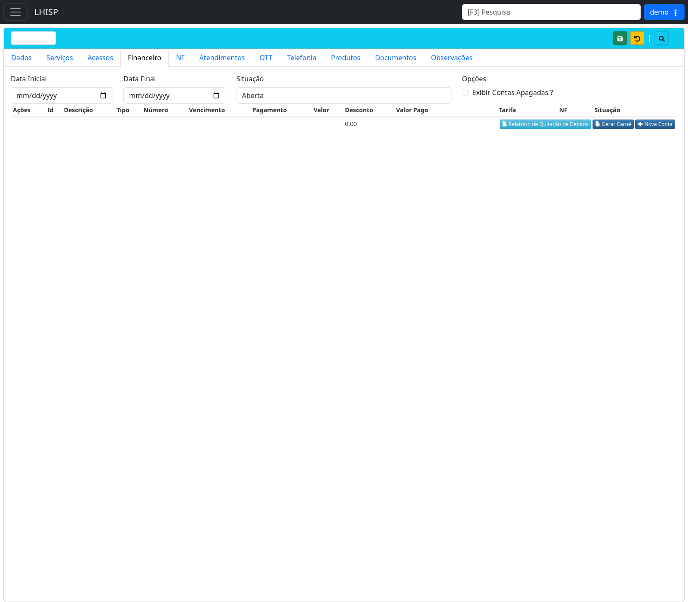

# Gerar contas do cliente

!!! warning "Rascunho gerado por agente"
    Este documento foi elaborado a partir de exploração no ambiente de demonstração. A geração efetiva de cobrança/carnê deve ser revisada por equipe financeira antes de publicação.

## Objetivo

Gerar, consultar ou cadastrar contas financeiras vinculadas ao contrato do cliente no módulo **Contratos**, aba **Financeiro**.

## Quando usar

Use este fluxo quando for necessário lançar uma nova conta, consultar cobranças abertas ou gerar carnê/relatório financeiro para um cliente.

## Pré-requisitos

- Cliente/contrato salvo.
- Serviço contratado cadastrado, quando a cobrança depender do serviço.
- Regras de vencimento, valor e descontos definidas.
- Usuário com permissão financeira no LHISP.
- Usar apenas dados fictícios no ambiente demo.
- Não apagar, cancelar ou remover contas reais durante a validação documental.

## Passo a passo

1. Acesse **Contratos**.
2. Abra o contrato do cliente.
3. Clique na aba **Financeiro**.
4. Use os filtros para consultar contas existentes:
   - **Data Inicial**;
   - **Data Final**;
   - **Situação**;
   - **Exibir Contas Apagadas?**, somente quando for necessário auditar registros apagados.
5. Clique na ação de pesquisa/atualização, se necessário.
6. Para cadastrar uma conta individual, clique em **+ Nova Conta**.
7. Preencha os campos financeiros solicitados pelo formulário.
8. Salve a conta.
9. Verifique se a conta aparece na tabela da aba **Financeiro**.
10. Para gerar cobrança em formato de carnê, clique em **Gerar Carnê** após validar as contas abertas.
11. Quando necessário, use **Relatório de Quitação de Débitos** para emitir documento relacionado à situação financeira do contrato.

## Campos importantes

### Filtros

| Campo | Descrição |
|---|---|
| **Data Inicial** | Início do período de consulta. |
| **Data Final** | Fim do período de consulta. |
| **Situação** | Filtra contas por status. Opções observadas: Todas, Aberta, Paga, Cancelada e Negociada. |
| **Exibir Contas Apagadas?** | Inclui contas apagadas na consulta. Use com cuidado. |

### Tabela financeira

| Campo/coluna | Descrição |
|---|---|
| **Ações** | Ações por conta. Confirmar quais ações existem e quais são destrutivas. |
| **Id** | Identificador interno da conta. |
| **Descrição** | Descrição do lançamento. |
| **Tipo** | Tipo da conta/cobrança. |
| **Número** | Número do documento/parcela. |
| **Vencimento** | Data de vencimento. |
| **Pagamento** | Data de pagamento, quando houver. |
| **Valor** | Valor original da conta. |
| **Desconto** | Desconto aplicado. |
| **Valor Pago** | Valor efetivamente pago. |
| **Tarifa** | Tarifa associada à cobrança. |
| **NF** | Relação com nota fiscal, quando aplicável. |
| **Situação** | Status financeiro da conta. |

## Resultado esperado

- A conta é criada e vinculada ao contrato do cliente.
- A conta aparece na aba **Financeiro** conforme os filtros selecionados.
- O carnê ou relatório é gerado quando houver contas elegíveis.

## Problemas comuns

| Problema | Como tratar |
|---|---|
| Conta não aparece na grade | Ajuste os filtros de data e situação. |
| Botão **+ Nova Conta** indisponível | Confirme permissões financeiras e se o contrato está salvo. |
| Valor divergente | Confira plano, desconto e regras de geração de contas. |
| Carnê não gera | Verifique se existem contas abertas e elegíveis no período. |
| Situação incorreta | Confirme se a conta foi paga, cancelada, negociada ou permanece aberta. |
| Contas apagadas aparecem | Desmarque **Exibir Contas Apagadas?** para operação normal. |

## Observações

- A aba **Financeiro** possui botões **Relatório de Quitação de Débitos**, **Gerar Carnê** e **+ Nova Conta**.
- Durante a exploração, a geração efetiva de contas/carnê não foi concluída para evitar efeitos financeiros mesmo em ambiente demo.
- O filtro **Exibir Contas Apagadas?** deve ser usado apenas para consulta/auditoria.
- Evite ações de exclusão, cancelamento ou remoção em contas durante testes de documentação.

## Dúvidas para revisão

- A geração de contas é feita manualmente por **+ Nova Conta** ou há rotina automática por serviço contratado?
- O botão **Gerar Carnê** considera todas as contas abertas ou apenas contas filtradas/selecionadas?
- Quais campos são obrigatórios no cadastro de nova conta?
- Existe regra de vencimento padrão baseada no contrato?
- O campo **NF** é gerado automaticamente ou preenchido após emissão fiscal?
- Quais ações da coluna **Ações** são permitidas para operadores comuns?

## Screenshots sugeridos

- Aba **Financeiro** do contrato: `docs/assets/screenshots/contratos/financeiro-aba.png`

