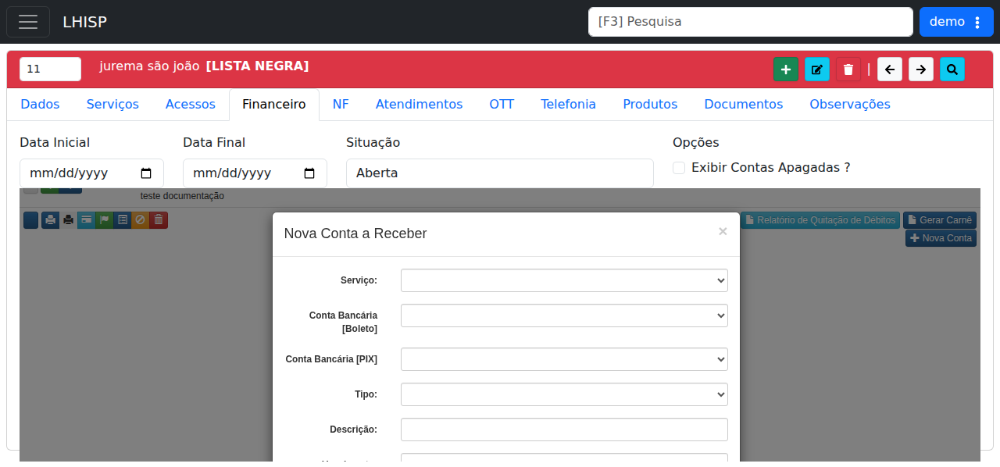

# Gerar contas a receber do contrato

!!! warning "Rascunho gerado por agente"
    Este documento foi elaborado a partir de exploração no ambiente de demonstração. A geração de cobrança deve ser revisada pela equipe responsável antes de publicação.

## Objetivo

Gerar uma **conta a receber** vinculada a um contrato do cliente na aba **Financeiro**.

## Quando usar

Use este fluxo quando for necessário lançar uma cobrança individual, revisar contas em aberto ou gerar parcelas financeiras para um contrato.

## Pré-requisitos

- Contrato salvo e disponível no módulo **Contratos**.
- Serviço contratado cadastrado, quando a cobrança depender de um plano/serviço específico.
- Usuário com permissão financeira no LHISP.
- Usar apenas dados fictícios no ambiente demo.

## Passo a passo

1. Acesse **Contratos**.
2. Abra o contrato desejado na lista.
3. Clique na aba **Financeiro**.
4. Revise os filtros de consulta, se necessário:
   - **Data Inicial**
   - **Data Final**
   - **Situação**
   - **Exibir Contas Apagadas?**
5. Verifique a grade de contas a receber exibida na tela.
6. Role até o final da aba **Financeiro** e clique em **Nova Conta**.
7. No modal **Nova Conta a Receber**, preencha os campos principais:
   - **Serviço**
   - **Conta Bancária [Boleto]**
   - **Conta Bancária [PIX]**
   - **Tipo**
   - **Descrição**
   - **Vencimento**
   - **Valor**
   - **Parcelas**
8. Clique em **Salvar**.
9. Confirme que a nova linha aparece na grade da aba **Financeiro** com situação **EM ABERTO**.

## Campos importantes

### Filtros da aba Financeiro

| Campo | Descrição |
|---|---|
| **Data Inicial** | Início do período de consulta. |
| **Data Final** | Fim do período de consulta. |
| **Situação** | Filtra contas por status. Opções observadas: **Todas**, **Aberta**, **Paga**, **Cancelada** e **Negociada**. |
| **Exibir Contas Apagadas?** | Inclui registros apagados na consulta. Use apenas para auditoria. |

### Grade de contas a receber

| Campo/coluna | Descrição |
|---|---|
| **Ações** | Ações por conta, incluindo pagamento e outras rotinas. |
| **Id** | Identificador interno da conta. |
| **Descrição** | Descrição do lançamento. |
| **Tipo** | Tipo da cobrança, como **MENSALIDADE**. |
| **Número** | Número da parcela/documento. |
| **Vencimento** | Data de vencimento. |
| **Pagamento** | Data de pagamento, quando houver. |
| **Valor** | Valor original da conta. |
| **Desconto** | Desconto aplicado. |
| **Valor Pago** | Valor efetivamente pago. |
| **Tarifa** | Tarifa associada à cobrança. |
| **NF** | Relação com nota fiscal, quando aplicável. |
| **Situação** | Status da conta, por exemplo **EM ABERTO**. |

### Modal Nova Conta a Receber

| Campo | Descrição |
|---|---|
| **Serviço** | Vincula a cobrança ao serviço contratado. |
| **Conta Bancária [Boleto]** | Conta bancária usada no boleto. |
| **Conta Bancária [PIX]** | Conta bancária usada no Pix. |
| **Tipo** | Natureza da cobrança, por exemplo **Mensalidade**, **Serviço**, **Vendas**, **Instalação**, **Acordo** ou **Multas**. |
| **Descrição** | Texto livre para identificar o lançamento. |
| **Vencimento** | Data de vencimento da conta. |
| **Valor** | Valor da cobrança. |
| **Parcelas** | Quantidade de parcelas geradas para o lançamento. |

## Resultado esperado

- A conta a receber é criada e vinculada ao contrato.
- A nova linha aparece na tabela da aba **Financeiro**.
- A situação do registro fica visível como **EM ABERTO** até o pagamento ou outra ação financeira.

## Problemas comuns

| Problema | Como tratar |
|---|---|
| A grade não mostra a conta criada | Ajuste os filtros de data e situação, ou recarregue a aba **Financeiro**. |
| O botão **Nova Conta** não aparece | Role até a parte inferior da tela e confirme que está na aba **Financeiro**. |
| O modal não permite salvar | Revise principalmente **Serviço**, **Tipo**, **Vencimento**, **Valor** e as contas de boleto/Pix. |
| A conta não aparece após salvar | Reabra a aba **Financeiro** e confira se a situação está filtrada como **Aberta**. |
| Contas apagadas aparecem na consulta | Desmarque **Exibir Contas Apagadas?**. |

## Observações

- A aba **Financeiro** possui as ações **Relatório de Quitação de Débitos**, **Gerar Carnê** e **Nova Conta**.
- Na exploração do demo, foi possível criar uma conta a receber de teste e ela passou a aparecer na grade como **EM ABERTO**.
- O contrato usado na exploração possuía contas mensais associadas ao serviço **[16250] ACESSO RESIDENCIAL 200mega**.

## Dúvidas para revisão

- A geração de contas é manual, automática por serviço ou ambas?
- O botão **Gerar Carnê** usa todas as contas em aberto ou apenas as selecionadas/filtradas?
- Quais campos são obrigatórios no modal **Nova Conta a Receber** em produção?
- O campo **Serviço** pode ficar vazio em algum tipo de lançamento?
- **Conta Bancária [PIX]** é obrigatória para todos os tipos de cobrança?

## Screenshots sugeridos

- Aba **Financeiro** do contrato: `docs/assets/screenshots/contratos/financeiro-aba.png`

- Modal **Nova Conta a Receber**: `docs/assets/screenshots/contratos/nova-conta-receber-modal.png`

