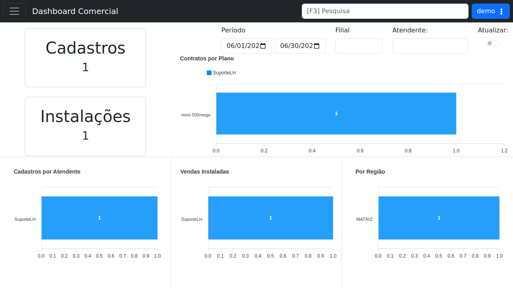

# Dashboard Comercial

!!! warning "Rascunho gerado por agente"
    Esta página foi documentada a partir da tela equivalente no ambiente de demonstração do LHISP. A captura utilizada veio do demo e foi mantida sem marcações visuais.

## Objetivo

Acompanhar indicadores comerciais do provedor, com visualização de cadastros, instalações, contratos por plano, vendas instaladas e distribuição por região.

## Quando usar

Use este dashboard quando precisar:

- acompanhar o volume de cadastros e instalações;
- filtrar indicadores por período;
- filtrar por filial e atendente;
- visualizar desempenho por plano, região e atendente.

## Pré-requisitos

- Estar autenticado no LHISP.
- Ter permissão para acessar o menu **Dashboard Comercial**.
- Possuir dados cadastrados para que os indicadores sejam exibidos.

## Passo a passo

1. Acesse o menu **Dashboard Comercial**.
2. Ajuste o **Período** de análise, se necessário.
3. Preencha os filtros de **Filial** e **Atendente**, quando aplicável.
4. Observe os cartões e gráficos exibidos na tela.
5. Use a opção de **Atualizar** para recarregar os indicadores.

## Campos importantes

| Campo / ação | Descrição |
|---|---|
| **Período** | Intervalo usado para filtrar os indicadores. |
| **Filial** | Restringe os dados da análise a uma unidade. |
| **Atendente** | Filtra os resultados por responsável. |
| **Atualizar** | Recarrega os dados exibidos no painel. |
| **Cadastros** | Cartão-resumo com a quantidade de cadastros no período. |
| **Instalações** | Cartão-resumo com a quantidade de instalações no período. |
| **Contratos por Plano** | Gráfico com a distribuição dos contratos por plano. |
| **Cadastros por Atendente** | Gráfico comparativo por atendente. |
| **Vendas Instaladas** | Gráfico de evolução das vendas instaladas. |
| **Por Região** | Gráfico de distribuição regional. |

## Resultado esperado

- O usuário consegue visualizar rapidamente o desempenho comercial.
- Os principais indicadores ficam resumidos em cartões e gráficos.
- O painel responde aos filtros de período, filial e atendente.

## Problemas comuns

| Problema | Como tratar |
|---|---|
| Os cartões aparecem zerados | Verifique se há dados cadastrados no período selecionado. |
| Os gráficos não mudam | Confirme os filtros de filial e atendente e use atualizar. |
| O painel demora para carregar | Aguarde a consolidação dos dados ou reduza o período consultado. |

## Observações

- O demo mostra a dashboard com cards de **Cadastros** e **Instalações** e gráficos de barras para os indicadores.
- O painel usa filtros de período, filial e atendente no topo da área principal.
- A captura usada nesta página veio do ambiente de demonstração.

## Dúvidas para revisão

- O indicador **Cadastros** representa apenas novos contratos ou também pré-cadastros?
- O gráfico **Vendas Instaladas** usa qual critério de data para consolidação?
- Os filtros têm impacto apenas visual ou alteram também exportações e relatórios associados?

## Screenshots sugeridos

- Tela **Dashboard Comercial** no demo: `docs/assets/screenshots/dashboards/dashboard-comercial.png`

