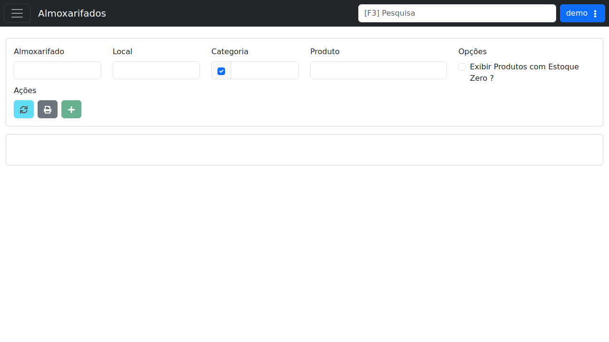

# Almoxarifados

!!! warning "Rascunho gerado por agente"
    Esta página foi documentada a partir da tela equivalente no ambiente de demonstração do LHISP. A captura utilizada veio do demo e foi mantida sem marcações visuais.

## Objetivo

Consultar e filtrar os almoxarifados e produtos de estoque disponíveis no sistema, com foco em localização, categoria, item e opções de exibição.

## Quando usar

Use esta tela quando precisar:

- localizar produtos por almoxarifado;
- filtrar itens por local, categoria ou nome de produto;
- verificar produtos com estoque zero;
- imprimir a listagem;
- registrar movimentações de estoque.

## Pré-requisitos

- Estar autenticado no LHISP.
- Ter permissão para acessar o menu **Almoxarifados**.
- Ter almoxarifados cadastrados, quando a filial exigir filtragem por unidade.

## Passo a passo

1. Acesse o menu **Almoxarifados**.
2. Selecione o **Almoxarifado** desejado.
3. Preencha, se necessário, os campos de **Local**, **Categoria** e **Produto**.
4. Marque ou desmarque a opção de exibição de estoque zero.
5. Use **Atualizar Listagem** para recarregar os dados.
6. Use **Imprimir** para gerar a impressão da listagem.
7. Use **Adicionar Movimentação** quando houver permissão para registrar entrada ou saída.

## Campos importantes

| Campo / ação | Descrição |
|---|---|
| **Almoxarifado** | Filtra a unidade de estoque exibida. |
| **Local** | Restringe a consulta ao endereço interno do estoque. |
| **Categoria** | Filtra os produtos por categoria de estoque. |
| **Produto** | Busca direta por item específico. |
| **Exibir Produtos com Estoque Zero ?** | Inclui produtos sem saldo na listagem. |
| **Atualizar Listagem** | Recarrega o resultado da consulta. |
| **Imprimir** | Gera a saída para impressão. |
| **Adicionar Movimentação** | Abre o fluxo de movimentação de estoque, quando habilitado. |

## Resultado esperado

- A listagem exibe os itens de estoque de acordo com os filtros aplicados.
- O operador consegue imprimir a visão atual.
- Movimentações podem ser iniciadas a partir da mesma tela, quando permitido.

## Problemas comuns

| Problema | Como tratar |
|---|---|
| Nenhum item aparece | Verifique o almoxarifado selecionado e os filtros aplicados. |
| O botão de atualização fica indisponível | Confirme se há campos obrigatórios pendentes ou contexto de sessão inválido. |
| A listagem não reflete o saldo esperado | Revise se o produto certo foi filtrado e se o estoque está zerado. |

## Observações

- O demo apresenta a tela já carregada com filtros de exemplo e sem resultados visíveis na grade inferior.
- A interface expõe ações rápidas de atualização, impressão e movimentação.
- A captura usada nesta página veio do ambiente de demonstração.

## Dúvidas para revisão

- Qual é a regra de negócio para exibir ou ocultar produtos com estoque zero?
- A opção **Adicionar Movimentação** depende de perfil ou de contexto do almoxarifado?
- A listagem inferior deve mostrar itens, saldos ou histórico de movimentações?

## Screenshots sugeridos

- Tela **Almoxarifados** no demo: `docs/assets/screenshots/almoxarifados/almoxarifados.png`

