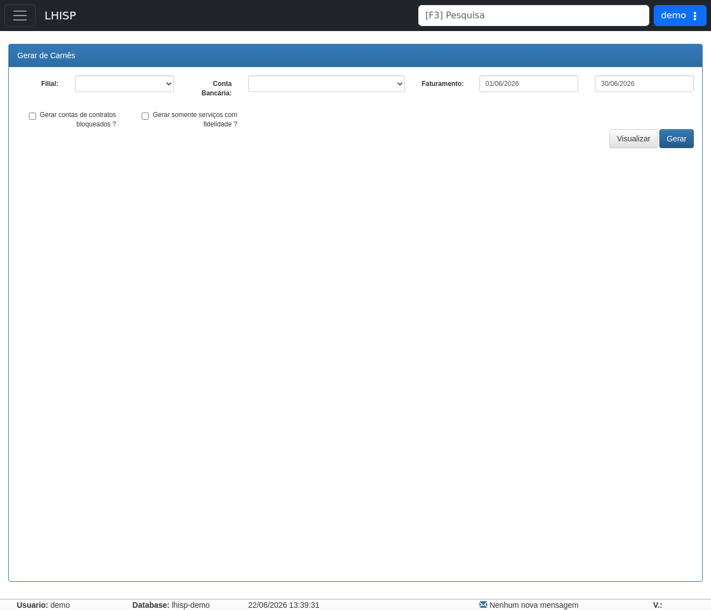

# Gerar Carnês

!!! warning "Rascunho gerado por agente"
    Esta página foi documentada a partir da tela equivalente no ambiente de demonstração do LHISP. A captura usada veio do demo e foi mantida sem marcações visuais.

## Objetivo

Gerar ou visualizar carnês a partir da filial, conta bancária e período de faturamento informados.

## Quando usar

Use esta tela quando precisar:

- gerar carnês para uma filial específica;
- escolher a conta bancária usada na emissão;
- limitar a geração por período de faturamento;
- incluir ou não contratos bloqueados;
- restringir a geração a serviços com fidelidade.

## Pré-requisitos

- Estar autenticado no LHISP.
- Ter permissão para acessar o fluxo **Gerar Carnês**.
- Ter filiais e contas bancárias cadastradas.
- Conhecer o período de faturamento a ser processado.

## Passo a passo

1. Acesse **Financeiro > Gerar Carnês**.
2. Selecione a **Filial**.
3. Escolha a **Conta Bancária**.
4. Informe o período de **Faturamento**.
5. Marque, se necessário, as opções adicionais de geração.
6. Use **Visualizar** para conferir o resultado ou **Gerar** para executar a emissão.

## Campos importantes

| Campo / ação | Descrição |
|---|---|
| **Filial** | Filial usada como base da geração. |
| **Conta Bancária** | Conta que será usada na emissão dos carnês. |
| **Faturamento inicial** | Data inicial do período considerado. |
| **Faturamento final** | Data final do período considerado. |
| **Gerar contas de contratos bloqueados ?** | Inclui contratos bloqueados na geração. |
| **Gerar somente serviços com fidelidade ?** | Restringe a emissão aos serviços com fidelidade. |
| **Visualizar** | Mostra uma prévia da emissão. |
| **Gerar** | Executa a geração dos carnês. |

## Resultado esperado

- A tela permite configurar a emissão dos carnês.
- O operador consegue validar os filtros antes de gerar.
- O sistema executa a emissão quando a ação **Gerar** é confirmada.

## Problemas comuns

| Problema | Como tratar |
|---|---|
| A lista de filiais está vazia | Verifique o cadastro de filiais e a permissão do perfil. |
| A conta bancária não aparece | Confirme se a conta existe e está habilitada para emissão. |
| A geração não produz resultado | Revise o período de faturamento e os filtros adicionais. |

## Observações

- A rota observada no demo foi `/lgc/financeiro%7Cgerar_carnes`.
- O título renderizado na área do iframe aparece como **Gerar de Carnês** no ambiente de demonstração.
- A tela operacional fica dentro de um iframe legado.
- A captura limpa mostra o formulário principal com **Filial**, **Conta Bancária**, **Faturamento** e dois checkboxes de geração.
- A área principal abaixo do formulário fica vazia até o operador acionar uma pré-visualização ou a geração.

## Dúvidas para revisão

- Qual é a diferença funcional exata entre **Visualizar** e **Gerar** no demo?
- A emissão respeita algum agrupamento adicional por contrato ou serviço?
- O fluxo produz apenas carnês ou também gera registros auxiliares de cobrança?

## Screenshots sugeridos

- Tela **Gerar Carnês** no demo: `docs/assets/screenshots/financeiro/gerar-carnes.png`

