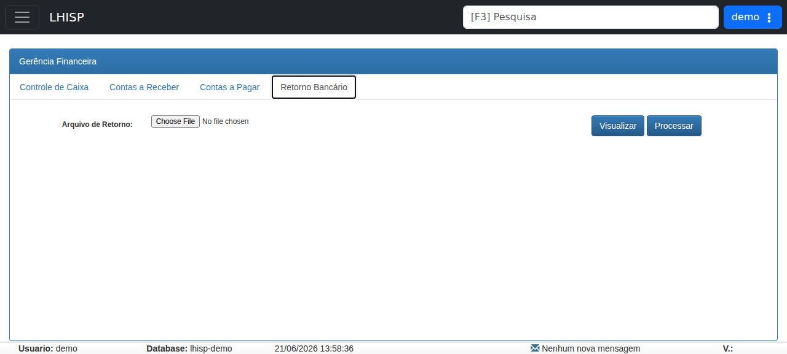

# Remessa Bancária

!!! warning "Rascunho gerado por agente"
    Este documento foi produzido a partir da exploração da wiki do LHISP e da tela equivalente no ambiente de demonstração. A execução de remessas depende da política bancária, da VAN utilizada e da validação da equipe financeira.

## Objetivo

Registrar o fluxo para **visualizar, gerar, baixar e enviar remessas bancárias** relacionadas aos boletos emitidos no sistema.

## Quando usar

Use este fluxo quando for necessário:

- consultar remessas geradas em determinado período;
- gerar uma nova remessa bancária;
- baixar o arquivo para envio ao banco ou à VAN;
- acompanhar o processamento das remessas.

## Pré-requisitos

- Acesso ao menu de **Gerência Financeira**.
- Permissão para gerar e enviar remessas.
- Conta bancária configurada no sistema.
- Boletos emitidos no período desejado.
- Ferramenta externa para envio ao banco ou à VAN, quando aplicável.

## Passo a passo

### 1. Visualizar remessas bancárias

1. Acesse o menu de **Gerência Financeira**.
2. Abra a aba **Retorno Bancário** ou a área equivalente de remessas.
3. Selecione a **conta bancária**.
4. Informe o **período** desejado.
5. Consulte a lista de remessas geradas.

### 2. Gerar uma nova remessa

1. Clique em **Novo** para abrir o formulário de geração.
2. Selecione a **conta bancária**.
3. Informe o **período** desejado.
4. Opcionalmente, filtre contratos **Bloqueados** e **Pendentes**.
5. Clique em **Visualizar** para listar os títulos que entrarão na remessa.
6. Confirme a geração.
7. Verifique a mensagem de sucesso ou erro no resumo exibido.

### 3. Baixar e enviar a remessa

1. Volte para a listagem de remessas.
2. Localize a remessa recém-gerada.
3. Use o botão de **download** para baixar o arquivo.
4. Envie o arquivo para o banco ou para a VAN conforme o procedimento da instituição.

## Campos importantes

| Campo / ação | Descrição |
|---|---|
| **Conta bancária** | Conta usada para filtrar ou gerar a remessa. |
| **Período** | Intervalo de boletos que entrarão na remessa. |
| **Bloqueados** | Filtro para incluir ou excluir contratos bloqueados. |
| **Pendentes** | Filtro para incluir ou excluir contratos pendentes. |
| **Visualizar** | Lista os títulos que serão incluídos. |
| **Novo** | Inicia a geração de uma nova remessa. |
| **Download** | Baixa o arquivo gerado para envio externo. |

## Resultado esperado

- A remessa fica listada no sistema.
- O arquivo é gerado para envio ao banco ou VAN.
- O operador consegue acompanhar o status do envio e da confirmação.

## Problemas comuns

| Problema | Como tratar |
|---|---|
| A lista de remessas não aparece | Confirme a conta bancária e o período selecionados. |
| A remessa gera vazio | Verifique se há boletos dentro do intervalo informado. |
| O arquivo não baixa | Confira permissões, navegador e bloqueios locais. |
| O banco rejeita o arquivo | Valide o formato exigido pela instituição e a integração com a VAN. |

## Observações

- A wiki trata a remessa bancária como um processo periódico e essencial desde a obrigatoriedade dos boletos registrados.
- O fluxo pode envolver um aplicativo externo da instituição bancária ou uma VAN terceirizada.
- O demo expõe a área de **Gerência Financeira** com a aba **Retorno Bancário**, que corresponde visualmente ao fluxo de remessa.
- A captura usada nesta página veio do ambiente de demonstração, não da wiki.

## Dúvidas para revisão

- A aba **Retorno Bancário** é o nome oficial da funcionalidade na aplicação de produção?
- Há diferença entre remessa gerada e remessa confirmada no fluxo atual?
- Quais filtros devem ser obrigatórios antes da geração?
- Existe um procedimento padrão por banco ou VAN para o envio do arquivo?

## Screenshots sugeridos

- Tela **Gerência Financeira > Retorno Bancário** no demo: `docs/assets/screenshots/financeiro/remessa-bancaria.png`

