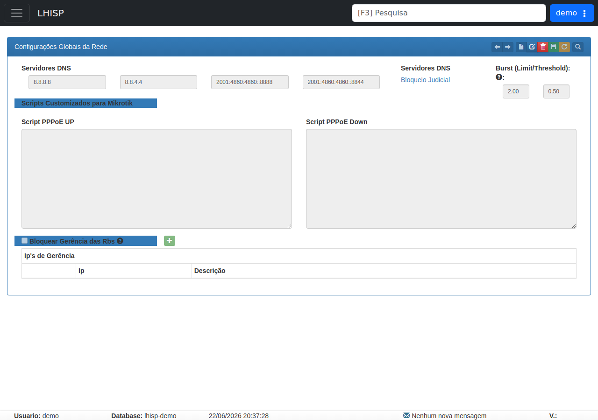

# Configurações Globais da Rede

!!! warning "Rascunho gerado por agente"
    Este documento foi produzido a partir da tela observada no ambiente de demonstração do LHISP. A captura usada nesta página foi validada visualmente e mostra a área principal de configurações globais do módulo de Rede/ Infra.

## Objetivo

Registrar a tela de **Configurações Globais da Rede**, usada para centralizar parâmetros compartilhados do módulo de rede, como DNS, burst e scripts customizados para Mikrotik.

## Quando usar

Use este fluxo para:

- revisar os DNS globais do ambiente;
- acessar o atalho de **Bloqueio Judicial**;
- verificar parâmetros de *burst*;
- revisar scripts customizados para Mikrotik;
- consultar a lista de IPs de gerência bloqueados ou controlados.

## Pré-requisitos

- Acesso ao módulo **Rede/ Infra**.
- Permissão para consultar ou alterar configurações globais.
- Conhecimento dos DNS e parâmetros operacionais do ambiente.
- Tela carregada no demo com a seção principal acessível.

## Passo a passo

1. Acesse **Rede/ Infra > Configurações Globais**.
2. Revise os campos de **Servidores DNS**.
3. Verifique o atalho para **Bloqueio Judicial**.
4. Confira os valores de **Burst (Limit/Threshold)**.
5. Analise os campos de **Script PPPoE UP** e **Script PPPoE Down**.
6. Se necessário, habilite **Bloquear Gerência das Rbs** e revise os **IP's de Gerência**.
7. Use a barra de ações do topo para navegar, editar ou salvar quando a tela estiver liberada.

## Campos importantes

| Campo / elemento | Observação |
|---|---|
| **Servidores DNS** | Quatro campos visíveis na tela, com valores preenchidos para IPv4 e IPv6. |
| **Bloqueio Judicial** | Atalho visível ao lado da seção de DNS. |
| **Burst (Limit/Threshold)** | Dois campos numéricos usados para limite e *threshold*. |
| **Script PPPoE UP** | Área de texto para script customizado. |
| **Script PPPoE Down** | Área de texto para script customizado. |
| **Bloquear Gerência das Rbs** | Opção de controle de acesso/gerência. |
| **IP's de Gerência** | Tabela para listar IPs e descrições associadas. |

## Resultado esperado

- Os parâmetros globais ficam centralizados em uma única tela.
- Os DNS e scripts customizados podem ser revisados rapidamente.
- A política de bloqueio/gerência fica visível para consulta e manutenção.
- O módulo de rede mantém os valores operacionais alinhados com o ambiente.

## Problemas comuns

| Problema | Como tratar |
|---|---|
| O DNS exibido não bate com o esperado | Confirme se o ambiente correto foi selecionado antes de editar. |
| Os scripts estão vazios | Verifique se a automação já foi definida para o ambiente. |
| A seção de IPs de gerência está sem linhas | Cadastre os IPs permitidos quando a política exigir controle. |
| Não consigo editar | Revise permissões do usuário no módulo de rede. |

## Observações

- A tela foi observada em um **iframe legado**.
- A captura validada estava limpa, sem marcações ou anotações visuais.
- Os DNS exibidos na tela são apenas os valores observados no demo e não devem ser tratados como padrão universal.
- A rota observada no demo é `https://demo.lhprovedor.com.br/lgc/redeinfra%7Cconfiguracoes`.

## Dúvidas para revisão

- Os DNS mostrados são editáveis por ambiente ou herdados de outra configuração?
- O link **Bloqueio Judicial** abre uma página própria ou apenas um detalhe da mesma configuração?
- O bloqueio de gerência vale para todos os tipos de equipamento ou só para RBS/Mikrotik?
- Os scripts PPPoE são globais ou por cliente/POP?

## Screenshots sugeridos

- Tela principal de **Configurações Globais da Rede** no demo: `docs/assets/screenshots/rede-infra/configuracoes-globais.png`

