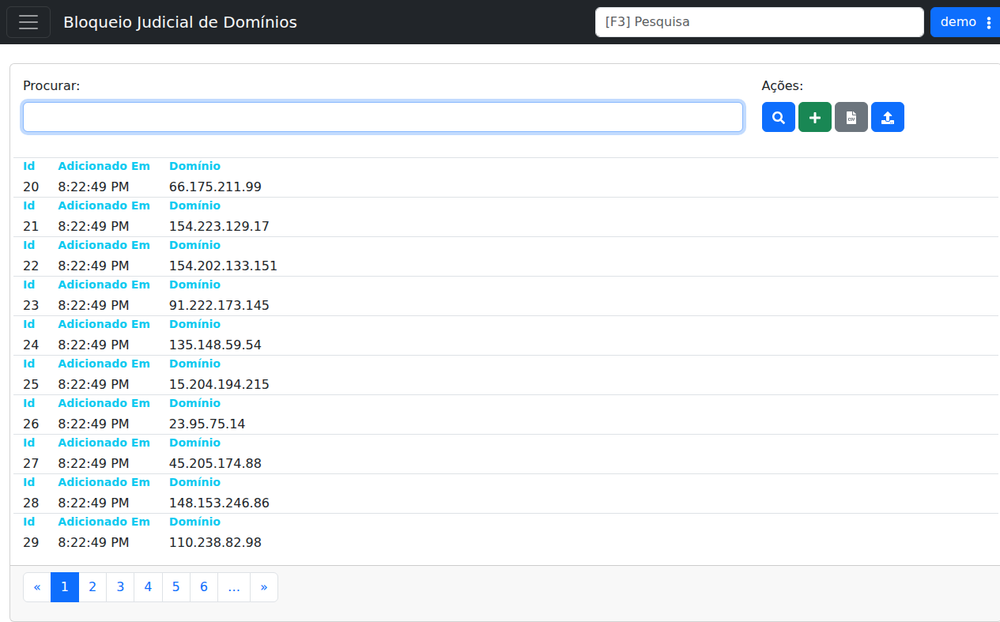

# DNS Bloqueio Judicial

!!! warning "Rascunho gerado por agente"
    Este documento foi produzido a partir da exploração da wiki do LHISP e da visualização da tela correspondente no ambiente de demonstração. Endereços, caminhos de arquivos e comandos sensíveis devem ser validados pela equipe técnica antes de qualquer uso em produção.

## Objetivo

Configurar o **bloqueio judicial de domínios** usando **BIND**, com o arquivo de zona e a integração necessária para que o LHISP publique e atualize a lista de bloqueios.

## Quando usar

Use este fluxo quando for necessário:

- habilitar o bloqueio judicial via BIND;
- baixar os arquivos de configuração publicados pelo LHISP;
- validar o arquivo de zona antes de aplicar;
- automatizar a atualização por cron;
- consultar a tela de domínios bloqueados no demo.

## Pré-requisitos

- Acesso ao servidor DNS/BIND.
- Permissão para editar arquivos em `/etc/named/` e `/var/named/`.
- Acesso ao endpoint do LHISP usado para publicar os arquivos.
- Utilitário `curl` instalado.
- Ferramentas `named-checkzone` e `named-checkconf` disponíveis no servidor.
- Permissão para reiniciar o serviço `named`.

## Passo a passo

### 1. Adicionar a regra no `named.conf`

Inclua o arquivo de configuração do bloqueio judicial no `named.conf`:

```conf
include "/etc/named/bloqueio.judicial.conf";
```

### 2. Baixar os arquivos no servidor

Baixe a zona e o arquivo de configuração para os caminhos esperados:

```bash
curl https://seu_lhisp/api/dns/bloqueio.judicial.zone > /var/named/bloqueio.judicial.zone
curl https://seu_lhisp/api/dns/bloqueio.judicial.conf > /etc/named/bloqueio.judicial.conf
```

### 3. Validar os arquivos

Antes de aplicar, valide a zona e a configuração do BIND:

```bash
named-checkzone bloqueio.judicial /var/named/bloqueio.judicial.zone
named-checkconf /etc/named/bloqueio.judicial.conf
```

### 4. Automatizar com cron

A wiki mostra um script de atualização que baixa o arquivo, valida a configuração e reinicia o serviço quando a verificação passa.

```bash
#!/bin/bash

file_to_copy="/etc/named/bloqueio.judicial.conf"

curl https://seu_lhisp/api/dns/bloqueio.judicial.conf > "$file_to_copy.tmp"

if named-checkconf "$file_to_copy.tmp"; then
  echo "Bloqueio Judicial OK"

  mv -fv "$file_to_copy.tmp" "$file_to_copy"

  systemctl restart named

  echo "Done"
else
  echo "ERROR"
fi
```

### 5. Conferir a tela no demo

No demo, a página **Bloqueio Judicial de Domínios** mostra:

- campo de pesquisa;
- botão **Procurar**;
- botão **Cadastrar**;
- botão **Baixar Planilha**;
- botão **Importar CSV**;
- paginação dos registros;
- lista de domínios bloqueados com colunas de ID, data de inclusão e domínio.

## Campos importantes

### Tela de consulta do demo

| Campo / ação | Descrição |
|---|---|
| **Procurar** | Filtra os registros exibidos na lista. |
| **Cadastrar** | Abre o formulário para incluir um novo bloqueio. |
| **Baixar Planilha** | Exporta os registros em planilha. |
| **Importar CSV** | Permite importar uma lista de bloqueios. |
| **Id** | Identificador do registro exibido. |
| **Adicionado Em** | Horário/data de inclusão do item. |
| **Domínio** | Domínio ou endereço bloqueado exibido na lista. |

### Arquivos citados na wiki

| Arquivo | Finalidade |
|---|---|
| `/etc/named/bloqueio.judicial.conf` | Arquivo incluído no `named.conf`. |
| `/var/named/bloqueio.judicial.zone` | Zona com os domínios bloqueados. |

## Resultado esperado

- O BIND passa a carregar a configuração do bloqueio judicial.
- Os arquivos baixados pelo LHISP ficam disponíveis no servidor.
- A validação da zona e do `named.conf` evita aplicação de configuração inválida.
- A atualização automática pode ser agendada via cron.
- A tela do demo exibe os domínios bloqueados e suas ações de manutenção.

## Problemas comuns

| Problema | Como tratar |
|---|---|
| `named-checkzone` falha | Verifique o conteúdo da zona e o caminho do arquivo. |
| `named-checkconf` falha | Revise a sintaxe do arquivo `.conf` baixado. |
| O `named` não reinicia | Valide permissões, logs do serviço e a configuração carregada. |
| A lista não atualiza no demo | Use **Procurar** e confira a paginação ou a importação de CSV. |
| O endpoint não responde | Confirme URL, autenticação e conectividade até o LHISP. |

## Observações

- A wiki trata esta área como uma integração de DNS para bloqueio judicial.
- O fluxo combina publicação de arquivos, validação de BIND e automação por cron.
- O demo mostra a tela operacional de consulta de domínios bloqueados, com ações de cadastro, exportação e importação.
- A captura usada neste documento veio do ambiente de demonstração, não da wiki.

## Dúvidas para revisão

- O endpoint `api/dns/bloqueio.judicial.*` é exatamente esse em todos os ambientes?
- O arquivo de zona deve ser substituído integralmente ou há merge incremental?
- A tarefa de cron é obrigatória ou apenas recomendada?
- O botão **Cadastrar** no demo cria um domínio individual ou um lote de registros?
- O fluxo aceita apenas domínios ou também endereços IP como os mostrados na listagem do demo?

## Screenshots sugeridos

- Tela **Bloqueio Judicial de Domínios** no demo: `docs/assets/screenshots/rede-infra/dns-bloqueio-judicial.png`


