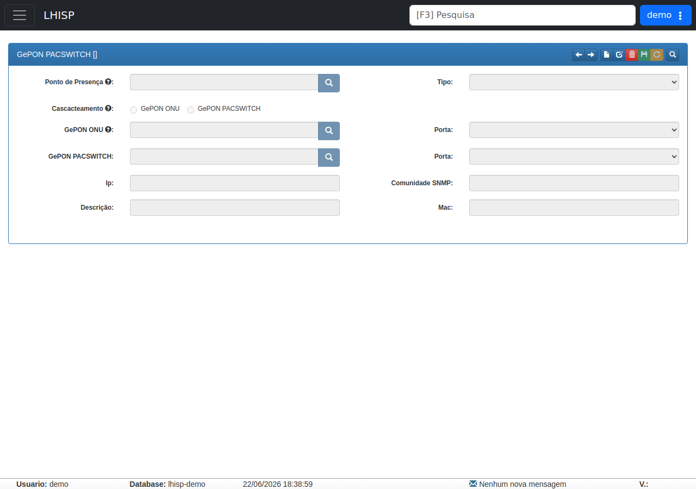

# GePON PACSWITCH

!!! warning "Rascunho gerado por agente"
    Este documento foi produzido a partir da tela observada no ambiente de demonstração do LHISP. A captura usada nesta página foi validada visualmente e mostra o formulário principal do PACSWITCH GePON.

## Objetivo

Registrar a tela de **GePON PACSWITCH** do módulo **Rede/ Infra**, que concentra o cadastro do equipamento, o relacionamento com GePON ONU ou outro PACSWITCH e os parâmetros de comunicação.

## Quando usar

Use este fluxo para:

- cadastrar ou revisar um PACSWITCH GePON;
- vincular o equipamento a um ponto de presença;
- definir o tipo do equipamento;
- escolher o modo de cascateamento;
- associar uma ONU GePON ou outro PACSWITCH;
- informar parâmetros de IP, SNMP e identificação.

## Pré-requisitos

- Acesso ao módulo **Rede/ Infra**.
- Permissão para consultar ou manter cadastros de PACSWITCH.
- Dados do ponto de presença e dos equipamentos relacionados.
- Tela carregada no demo com o formulário acessível.

## Passo a passo

1. Acesse **Rede/ Infra > GePON PACSWITCH**.
2. Use **Anterior** e **Próximo** para navegar entre registros.
3. Clique em **Novo**, **Editar** ou **Apagar** conforme a necessidade do cadastro.
4. Preencha os campos do formulário principal.
5. Escolha o tipo de cascateamento entre **GePON ONU** e **GePON PACSWITCH**.
6. Use **Salvar** ou **Cancelar** para concluir a operação.
7. Se precisar localizar um registro, utilize **Procurar**.

## Campos importantes

| Campo / elemento | Observação |
|---|---|
| **Ponto de Presença** | Associa o PACSWITCH ao POP correspondente. |
| **Tipo** | Seletor do tipo do equipamento; a tela exibiu **PACSWITCH FIT 7P** e **PACSWITCH FIT 14P**. |
| **Cascateamento** | Define se o vínculo será com **GePON ONU** ou **GePON PACSWITCH**. |
| **GePON ONU** | Campo de associação quando o cascateamento apontar para ONU. |
| **GePON PACSWITCH** | Campo de associação quando o cascateamento apontar para outro PACSWITCH. |
| **Porta** | Combo usado para escolher a porta vinculada em cada associação. |
| **IP** | Endereço de gerenciamento do PACSWITCH. |
| **Comunidade SNMP** | Comunidade usada para monitoramento. |
| **Descrição** | Campo livre para identificação do registro. |
| **Mac** | Endereço MAC do equipamento. |

## Resultado esperado

- O PACSWITCH GePON fica associado ao ponto de presença correto.
- O modo de cascateamento fica definido de forma consistente.
- As associações com ONU ou com outro PACSWITCH ficam registradas.
- O cadastro pode ser consultado e mantido a partir da barra de ações.

## Problemas comuns

| Problema | Como tratar |
|---|---|
| Não encontro o POP desejado | Use a busca do campo **Ponto de Presença** ou revise o cadastro base. |
| O tipo correto não aparece | Confirme se o perfil do PACSWITCH está disponível na lista. |
| A associação com ONU não aparece | Verifique se o cascateamento está em **GePON ONU**. |
| A associação com outro PACSWITCH não aparece | Verifique se o cascateamento está em **GePON PACSWITCH**. |
| Não consigo salvar | Confirme se os campos obrigatórios foram preenchidos. |

## Observações

- A tela é um **iframe legado** com cabeçalho próprio do módulo.
- A captura validada estava limpa, sem marcações ou anotações visuais.
- O formulário principal exibe as associações de cascateamento separadas por tipo.
- A rota observada no demo é `https://demo.lhprovedor.com.br/lgc/redeinfra%7Cpacswitch`.

## Dúvidas para revisão

- O campo **Cascateamento** é mutuamente exclusivo entre ONU e PACSWITCH em produção?
- O combo **Porta** muda conforme o tipo de associação escolhido?
- O PACSWITCH salva somente o cadastro ou também altera parâmetros de rede no equipamento?
- Existe alguma relação funcional entre este cadastro e o fluxo de **GePON OLT**?

## Screenshots sugeridos

- Tela principal de **GePON PACSWITCH** no demo: `docs/assets/screenshots/rede-infra/gepon-pacswitch.png`

