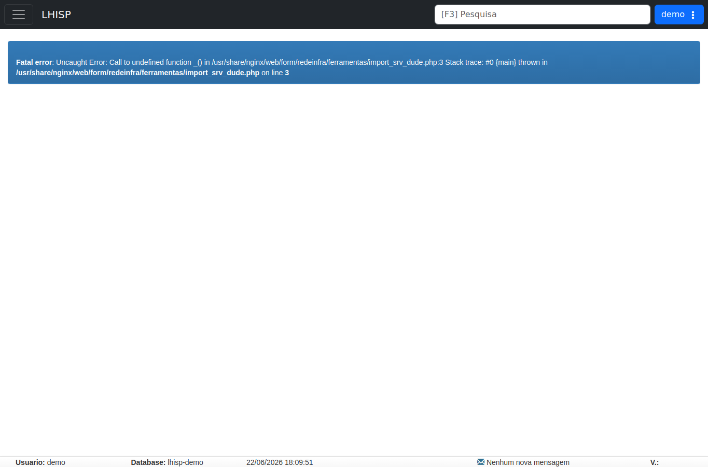

# Importar Arq. Dude

!!! warning "Rascunho gerado por agente"
    Esta página registra o estado observado no ambiente de demonstração do LHISP. Neste caso, o demo não renderizou o formulário esperado: a tela apresentou um erro fatal de PHP logo ao abrir.

## Objetivo

Importar dados do **Dude** para o LHISP, presumivelmente para cadastrar ou atualizar dispositivos de rede a partir da estrutura existente no monitoramento.

## Quando usar

Use este fluxo quando precisar:

- importar equipamentos do Dude;
- sincronizar o inventário de rede;
- atualizar vínculos de dispositivos com o LHISP;
- validar uma importação já preparada.

## Pré-requisitos

- Estar autenticado no LHISP.
- Ter acesso ao fluxo **Importar Arq. Dude**.
- Dispor do arquivo ou da integração necessária ao processo de importação.

## Passo a passo

1. Acesse **Rede/ Infra > Ferramentas > Importar Arq. Dude**.
2. Aguarde o carregamento do fluxo.
3. Se o formulário estiver disponível, siga as instruções da tela para selecionar os dados de importação.
4. Valide o resultado ao final da operação.

## Campos importantes

> **Não foi possível identificar campos ou botões úteis na captura do demo**, porque a página não carregou o formulário e exibiu um erro fatal logo na abertura.

## Resultado esperado

- O formulário de importação deveria abrir normalmente.
- O usuário deveria conseguir selecionar ou validar os dados do Dude.
- O processo deveria retornar uma importação concluída ou um feedback claro de validação.

## Problemas comuns

| Problema | Como tratar |
|---|---|
| Erro fatal ao abrir a tela | A própria página do demo está quebrada; registrar como bloqueio real. |
| Não há formulário visível | O backend não renderizou a página esperada. |

## Observações

- A rota observada no demo foi `/lgc/redeinfra%7Cferramentas%7Cimport_srv_dude`.
- A tela é renderizada dentro de um **iframe legado**.
- O demo exibiu a mensagem: `Fatal error: Uncaught Error: Call to undefined function _() in /usr/share/nginx/web/form/redeinfra/ferramentas/import_srv_dude.php:3 Stack trace: #0 {main} thrown in /usr/share/nginx/web/form/redeinfra/ferramentas/import_srv_dude.php on line 3`.
- Não houve formulário operacional disponível para documentação além do erro.

## Dúvidas para revisão

- O fluxo **Importar Arq. Dude** está quebrado apenas no demo ou também no ambiente real?
- Existe uma versão corrigida do formulário que deva substituir essa rota?
- O nome do arquivo sugerido no erro corresponde ao fluxo que a equipe realmente usa?

## Screenshots sugeridos

- Tela de erro do fluxo **Importar Arq. Dude** no demo: `docs/assets/screenshots/rede-infra/importar-arq-dude.png`

