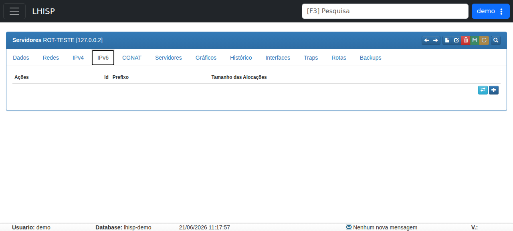

# IPv6

!!! warning "Rascunho gerado por agente"
    Este documento foi produzido a partir da exploração da wiki do LHISP. O conteúdo descreve a página de **IPv6** e deve ser validado pela equipe técnica antes de virar referência operacional definitiva.

## Objetivo

Registrar o procedimento descrito na wiki para **habilitar IPv6 nos Mikrotiks** e indicar como o tema pode ser tratado dentro do ecossistema LHISP.

## Quando usar

Use este fluxo quando for necessário:

- habilitar o pacote IPv6 em um Mikrotik;
- preparar o equipamento para uso de IPv6;
- consultar o comando sugerido pela wiki;
- orientar a ativação em massa pelo LHISP.

## Pré-requisitos

- Acesso ao menu **Rede/Infra**.
- Equipamento Mikrotik compatível.
- Permissão para alterar pacotes do sistema.
- Uso de dados fictícios ou ambiente controlado quando houver execução de testes.

## Passo a passo

1. Acesse a wiki do LHISP.
2. No menu lateral, entre em **Rede/Infra**.
3. Clique em **IPv6**.
4. Leia a seção **Habilitando IPv6 nos Mikrotiks**.
5. No Mikrotik, abra **System > Packages**.
6. Selecione o pacote **IPv6**.
7. Clique em **Enable**.
8. Reinicie o equipamento para concluir a ativação do pacote.
9. Se preferir, execute o comando informado pela wiki via terminal.
10. Para operação em massa, use o caminho indicado pela própria wiki em **Rede/Infra > Ferramentas > Enviar Comandos**.

## Campos e comandos importantes

### Ação principal observada

| Item | Observação |
|---|---|
| **System > Packages** | menu utilizado para localizar o pacote IPv6 no Mikrotik |
| **IPv6** | pacote que deve ser habilitado |
| **Enable** | botão usado para ativar o pacote |
| **Reinicialização** | necessária para que a ativação aconteça na próxima inicialização |

### Comando informado na wiki

```bash
/system package enable [find name=ipv6]
```

### Observação operacional

A própria wiki informa que o LHISP pode ajudar no envio desse comando em lote por meio de:

- **Rede/Infra > Ferramentas > Enviar Comandos**
- tipo: **Mikrotik**

## Resultado esperado

- O pacote IPv6 fica habilitado no Mikrotik.
- O equipamento passa a estar preparado para uso de IPv6.
- O operador pode aplicar a mesma lógica em vários equipamentos usando o recurso de envio de comandos.

## Problemas comuns

| Problema | Como tratar |
|---|---|
| O pacote não aparece em **System > Packages** | Verifique se o Mikrotik possui o pacote IPv6 instalado. |
| O IPv6 não ativa imediatamente | Reinicie o equipamento após clicar em **Enable**. |
| O comando falha no terminal | Revise o nome do pacote e se o equipamento está acessível. |
| A ativação em massa não encontra o destino | Confirme o tipo **Mikrotik** e o caminho de envio de comandos no LHISP. |

## Observações

- A página é curta e objetiva, focada no passo inicial de habilitação do IPv6.
- O conteúdo reforça que o LHISP também pode ser usado como apoio para distribuir comandos em rede.
- A wiki faz referência a uma imagem do menu **Packages**, mas o arquivo local não estava embutido na página; por isso, a documentação foi baseada no texto visível.

## Dúvidas para revisão

- O LHISP apenas distribui o comando ou também acompanha a confirmação da ativação?
- Há alguma validação adicional após reiniciar o Mikrotik?
- A ativação em massa via **Enviar Comandos** exige algum template específico?

## Screenshots sugeridos

- Aba **IPv6** no demo: `docs/assets/screenshots/rede-infra/ipv6.png`


