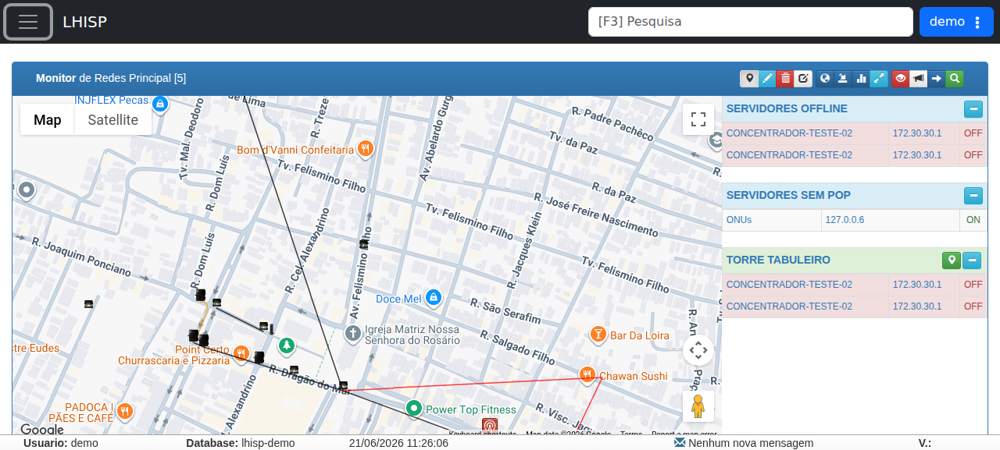

# Monitor de Redes

!!! warning "Rascunho gerado por agente"
    Este documento foi produzido a partir da exploração da wiki do LHISP e da visualização do monitor no ambiente de demonstração. Antes de uso operacional definitivo, a equipe técnica deve validar os detalhes de cadastro, mapa e classificação dos POPs.

## Objetivo

Registrar como o LHISP apresenta e organiza o **Monitor de Redes**, com foco nos **Pontos de Presença (POPs)**, sua visualização em mapa e os caminhos descritos para cadastro manual ou por geolocalização.

## Quando usar

Use este fluxo para:

- visualizar POPs e ativos de rede em um mapa;
- cadastrar um novo **Ponto de Presença**;
- entender como o sistema organiza POPs por localização;
- consultar listas laterais de servidores e pontos sem POP.

## Pré-requisitos

- Acesso ao módulo **Monitor de Redes**.
- Permissão para editar ou cadastrar POPs.
- Endereço/localização válida para o novo POP.
- Navegador com suporte a localização, caso o cadastro seja feito por GPS.

## Passo a passo

### Acessar o Monitor de Redes

1. Acesse o menu principal do LHISP.
2. Entre em **Monitor de Redes**.
3. Observe a tela principal com o mapa, a barra de ferramentas e as listas laterais.

### Cadastro manual de POP

1. Clique no ícone de edição/lápis na barra de ferramentas.
2. No mapa, localize o ponto onde deseja cadastrar o POP.
3. Dê um duplo clique na posição desejada.
4. Preencha os dados do POP na janela de cadastro.
5. Salve o registro.

### Cadastro por geolocalização

1. Acesse o Monitor de Redes com um navegador que suporte geolocalização.
2. Quando o navegador solicitar, permita o acesso à localização.
3. O sistema exibirá a tela de cadastro já posicionada na localização informada.
4. Complete os dados do POP e salve.

## Campos importantes

### Cadastro de POP

| Campo | Descrição |
|---|---|
| **Nome** | Nome curto do ponto de presença. |
| **Descrição** | Texto livre com informações do POP. |
| **Tipo** | Define o ícone exibido no mapa. |
| **IP** | Reservado para monitoramento ICMP/ping, conforme a wiki. |
| **Filiais** | Define quais usuários podem visualizar o POP no monitor. |
| **Latitude / Longitude** | Coordenadas do ponto selecionado no mapa. |

### Elementos visuais observados no demo

| Elemento | Observação |
|---|---|
| **Mapa** | Exibe o monitor geográfico principal. |
| **Toolbar** | Reúne ações do monitor e atalhos de visualização. |
| **Servidores offline** | Lista lateral com equipamentos fora do ar. |
| **Servidores sem POP** | Lista lateral de servidores sem ponto de presença associado. |
| **Torre** | Agrupamento visual de ativos/pontos no mapa. |

## Resultado esperado

- Os POPs ficam visíveis no mapa do Monitor de Redes.
- O POP cadastrado passa a integrar a organização geográfica da rede.
- O sistema permite distinguir pontos com e sem POP associado.

## Problemas comuns

| Problema | Como tratar |
|---|---|
| Não consigo entrar no modo de edição | Verifique a permissão de usuário e o ícone correto na barra de ferramentas. |
| O navegador bloqueia a localização | Permita o acesso à geolocalização para prosseguir com o cadastro por GPS. |
| O POP não aparece no mapa | Confirme se foi salvo e se a localização está correta. |
| Não encontro o ativo na lista lateral | Verifique o agrupamento do mapa e o filtro/visão atual. |

## Observações

- A wiki descreve o Monitor de Redes como uma representação geolocalizada dos POPs usando integração com Google Maps.
- O cadastro manual depende de um duplo clique sobre o ponto desejado no mapa.
- O cadastro por geolocalização depende da autorização do navegador.
- O demo confirma a presença da tela principal com mapa e listas laterais de servidores.

## Dúvidas para revisão

- O botão de edição na barra de ferramentas corresponde sempre ao cadastro manual de POP?
- Quais campos são obrigatórios no cadastro de POP?
- O campo **IP** fica ativo para algum cenário específico de monitoramento?
- As **Filiais** restringem apenas a visualização ou também a edição?
- Há alguma diferença entre os POPs criados manualmente e os criados por geolocalização?

## Screenshots sugeridos

- Tela principal do **Monitor de Redes** no demo: `docs/assets/screenshots/rede-infra/monitor-redes.png`

