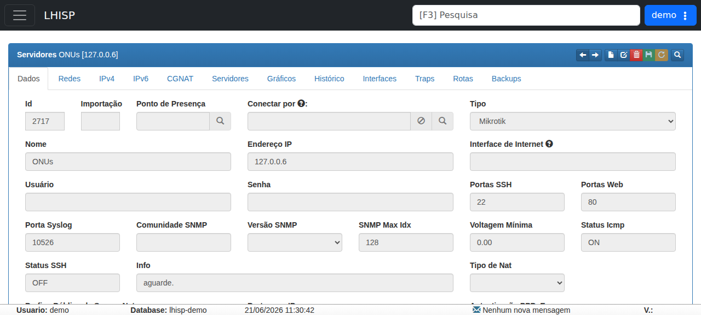

# OLT Huawei

!!! warning "Rascunho gerado por agente"
    Este documento foi produzido a partir da exploração da wiki do LHISP e da visualização de um fluxo relacionado no ambiente de demonstração. Credenciais, chaves e valores sensíveis foram omitidos ou resumidos e devem ser validados pela equipe técnica antes de publicação final.

## Objetivo

Registrar o procedimento descrito na wiki para configurar uma **OLT Huawei** e integrar o equipamento ao ecossistema **LHISP**.

## Quando usar

Use este fluxo quando for necessário:

- realizar a configuração inicial de uma OLT Huawei;
- habilitar acesso de gerenciamento ao equipamento;
- criar usuário administrativo para acesso pelo sistema;
- configurar endereço IP de gerenciamento em modo *out of band* ou *inband*;
- ajustar gateway e controle de acesso;
- preparar a OLT para integração operacional com o LHISP.

## Pré-requisitos

- Acesso físico ao equipamento via console serial.
- Cabo console DB9/RJ45 e adaptador, se necessário.
- Credenciais administrativas válidas.
- Endereço IP de gerenciamento da OLT.
- Máscara de rede e gateway padrão.
- Permissão para alterar a configuração do equipamento.
- Validação prévia de que o cenário pertence ao ambiente de demonstração ou a um laboratório autorizado.

## Passo a passo

### 1. Acessar a OLT

1. Conecte o cabo console ao equipamento.
2. Abra uma sessão serial no computador.
3. Entre com as credenciais administrativas.
4. Entre no modo privilegiado e depois no modo de configuração.

### 2. Entender os modos de operação

A wiki descreve três estados principais do prompt:

- **Execução**: prompt inicial após o login.
- **Enable**: modo com privilégios elevados.
- **Config**: modo de configuração do equipamento.

### 3. Definir o nome do equipamento

No modo de configuração, ajuste o `sysname` para identificar a OLT na rede.

```text
sysname NOME-DO-SEU-EQUIPAMENTO
```

### 4. Verificar e ativar placas do chassi

1. Liste as placas instaladas no chassi.
2. Confirme as placas conectadas e ative-as quando necessário.
3. Valide o status das placas de uplink e PON antes de seguir.

### 5. Criar usuário administrativo

Crie um usuário local que será usado para acesso e automação no ambiente LHISP.

### 6. Configurar gerenciamento da OLT

Há dois cenários descritos:

- **Out of Band**: usa a porta dedicada de gerenciamento.
- **Inband**: usa uma VLAN na porta de uplink.

### 7. Ajustar o gateway padrão

Configure a rota padrão apontando para o gateway do ambiente.

### 8. Controlar o acesso ao equipamento

A wiki menciona regras de acesso para restringir serviços como telnet/gestão conforme os IPs permitidos.

## Campos importantes

### Parâmetros observados na wiki

| Campo / comando | Descrição |
|---|---|
| **Login / Password** | Credenciais administrativas do equipamento. Os valores exibidos na wiki foram tratados como sensíveis e não foram reproduzidos aqui. |
| **enable** | Acesso ao modo privilegiado. |
| **config** | Entrada no modo de configuração. |
| **sysname** | Nome da OLT na rede. |
| **display board 0** | Comando para visualizar as placas do chassi. |
| **board confirm 0** | Confirma as placas instaladas/ativadas. |
| **terminal user name** | Criação de usuário local para administração. |
| **interface meth 0** | Configuração de gerenciamento *out of band*. |
| **interface vlanif 250** | Exemplo de gerenciamento *inband* via VLAN. |
| **ip route-static** | Configura a rota padrão do equipamento. |
| **sysman firewall telnet enable** | Exemplo de controle de acesso exposto na wiki. |

## Resultado esperado

- A OLT fica com nome e gerenciamento configurados.
- O acesso administrativo passa a existir com usuário local.
- O endereço de gerenciamento fica acessível ao LHISP e aos operadores autorizados.
- A rede pode seguir com os ajustes de operação e integração com clientes/serviços.

## Problemas comuns

| Problema | Como tratar |
|---|---|
| Não consigo acessar a console | Verifique cabo, adaptador serial e porta COM/tty. |
| `enable` ou `config` não funcionam | Confirme que a sessão foi aberta com credencial administrativa. |
| A OLT não responde no IP de gerenciamento | Revise IP, máscara, VLAN de gerenciamento e gateway. |
| Placas do chassi não aparecem corretamente | Refaça a leitura das placas e confirme o estado esperado antes de habilitar serviços. |
| O acesso remoto fica bloqueado | Revise as regras de controle de acesso descritas na wiki. |

## Observações

- A wiki trata a OLT Huawei como um fluxo de configuração de equipamento e gerenciamento de acesso.
- O conteúdo mistura instruções de console, gerenciamento *out of band* e *inband* e controle de acesso.
- Credenciais e valores exatos foram omitidos nesta documentação por segurança.
- O demo foi usado apenas como referência visual para o contexto de servidores/equipamentos de rede.

## Dúvidas para revisão

- Qual modo de gerenciamento é o padrão: *out of band* ou *inband*?
- Quais placas do chassi precisam obrigatoriamente ser confirmadas em produção?
- O usuário criado na OLT é sempre o mesmo usado pelo LHISP?
- Existem diferenças relevantes entre modelos Huawei suportados pela mesma documentação?
- Quais IPs devem ser liberados no controle de acesso?

## Screenshots sugeridos

- Tela de servidor/equipamento no demo usada como referência visual: `docs/assets/screenshots/rede-infra/olt-huawei.png`


