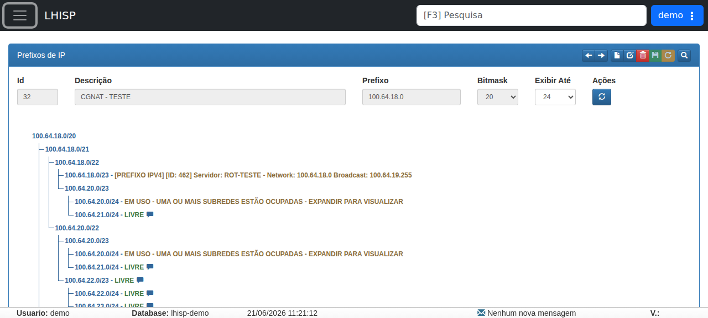

# Prefixos de IP

!!! warning "Rascunho gerado por agente"
    Este documento foi elaborado a partir de exploração no ambiente de demonstração. A criação efetiva de prefixos deve ser validada pela equipe técnica antes de publicação.

## Objetivo

Cadastrar e consultar **prefixos de IP** no módulo **Rede/Infra**.

## Quando usar

Use este fluxo para registrar faixas de endereçamento que serão usadas em redes, servidores, CGNAT ou distribuição de subprefixos.

## Pré-requisitos

- Acesso ao menu **Rede/ Infra**.
- Permissão para criar/editar prefixos.
- Dados do prefixo disponíveis: descrição, faixa e bitmask.
- Usar apenas dados fictícios no ambiente demo.

## Passo a passo

1. Acesse o menu lateral e abra **Rede/ Infra**.
2. Clique em **Prefixos de IP**.
3. Clique em **Novo** para entrar no modo de inclusão.
4. Preencha os campos principais:
   - **Descrição**
   - **Prefixo**
   - **Bitmask**
   - **Exibir Até**
5. Ajuste o valor de **Exibir Até** conforme a profundidade da árvore de subprefixos que deseja visualizar.
6. Clique em **Salvar**.
7. Valide se o prefixo aparece na lista/árvore e se os subprefixos são exibidos como esperado.

## Campos importantes

| Campo | Descrição |
|---|---|
| **Id** | Identificador interno do prefixo. |
| **Descrição** | Nome do prefixo. No teste realizado, foi criado o prefixo com descrição `PREFIXO TESTE DOCUMENTACAO`. |
| **Prefixo** | Rede base do prefixo, por exemplo `10.250.0.0`. |
| **Bitmask** | Máscara da rede. Opções observadas: **8** a **31**. |
| **Exibir Até** | Profundidade máxima da árvore exibida. Opções observadas: **8** a **32**. |
| **Ações** | Área de ação da tela, com botão de atualização/recarregamento. |

## Resultado esperado

- O prefixo fica cadastrado no módulo **Rede/Infra**.
- A árvore/lista passa a exibir a faixa e seus subprefixos.
- O prefixo pode ser reutilizado em redes, CGNAT ou vinculações técnicas.

## Problemas comuns

| Problema | Como tratar |
|---|---|
| O botão **Salvar** não grava | Revise **Descrição**, **Prefixo**, **Bitmask** e o modo atual da tela. |
| A árvore não aparece | Ajuste **Exibir Até** e confirme se o registro foi salvo. |
| O prefixo já existe | Utilize outra faixa não conflitante. |
| Os subprefixos não aparecem | Verifique se o prefixo base foi salvo corretamente e se a profundidade é suficiente. |
| O cadastro entra em modo de edição sem intenção | Confira se a tela não estava aberta sobre um registro existente. |

## Observações

- Na exploração, foi criado um prefixo de teste com:
  - **Descrição:** `PREFIXO TESTE DOCUMENTACAO`
  - **Prefixo:** `10.250.0.0`
  - **Bitmask:** `24`
  - **Exibir Até:** `28`
- Após salvar, a tela passou a mostrar o registro persistido e a área de árvore/lista de prefixos.
- O módulo exibe uma grade/árvore hierárquica para visualização dos prefixos disponíveis.

## Dúvidas para revisão

- A criação de prefixo exige apenas **Descrição**, **Prefixo** e **Bitmask** ou há outras validações?
- Como o sistema preenche automaticamente a árvore de subprefixos?
- O valor de **Exibir Até** impacta apenas a visualização ou também a expansão dos registros?
- Existe regra de unicidade para o mesmo prefixo com bitmask diferente?
- O botão de **Ações** executa apenas atualização ou há mais funções associadas?

## Screenshots sugeridos

- Tela de **Prefixos de IP** no demo após abrir o registro: `docs/assets/screenshots/rede-infra/prefixos-ip.png`

