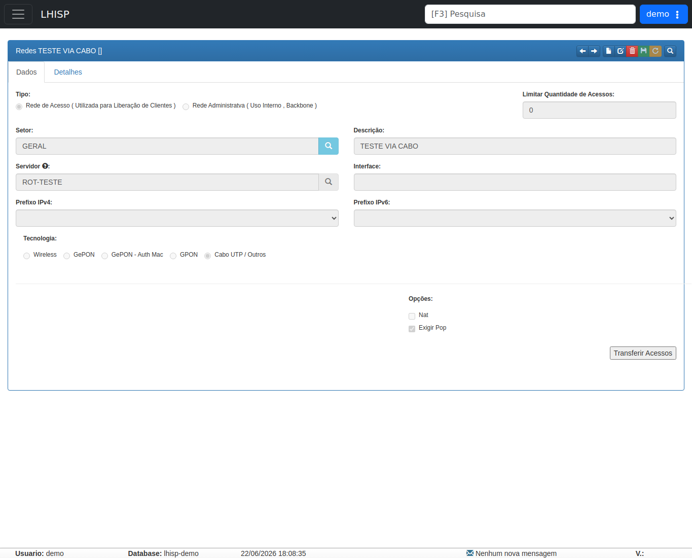

# Redes

!!! warning "Rascunho gerado por agente"
    Esta página foi documentada a partir da tela equivalente no ambiente de demonstração do LHISP. A captura usada veio do demo e foi mantida sem marcações visuais.

## Objetivo

Cadastrar e revisar redes vinculadas a servidores, setorização e tecnologia de acesso no módulo de **Rede/Infra**.

## Quando usar

Use esta tela quando precisar:

- criar ou editar uma rede;
- associar uma rede a um servidor;
- revisar a tecnologia de acesso;
- definir prefixos IPv4/IPv6;
- controlar opções como NAT e exigência de POP;
- transferir acessos para a rede selecionada.

## Pré-requisitos

- Estar autenticado no LHISP.
- Ter permissão para acessar o fluxo **Redes**.
- Conhecer o servidor, setor e tecnologia da rede que será cadastrada.

## Passo a passo

1. Acesse **Rede/ Infra > Redes**.
2. Confira o registro carregado na tela.
3. Use **Anterior** e **Próximo** para navegar entre redes.
4. Use **Novo**, **Editar** ou **Apagar** para manutenção do cadastro.
5. Em **Dados**, revise o tipo, setor, descrição, servidor e prefixos.
6. Em **Detalhes**, consulte informações complementares do registro.
7. Use **Transferir Acessos** quando precisar mover acessos vinculados à rede.

## Campos importantes

| Campo / ação | Descrição |
|---|---|
| **Tipo** | Define se a rede é de acesso ou administrativa. |
| **Limitar Quantidade de Acessos** | Quantidade máxima de acessos vinculados. |
| **Setor** | Setor associado à rede. |
| **Descrição** | Nome descritivo da rede. |
| **Servidor** | Servidor relacionado à rede. |
| **Interface** | Interface de conexão associada. |
| **Prefixo IPv4** | Prefixo IPv4 da rede. |
| **Prefixo IPv6** | Prefixo IPv6 da rede. |
| **Tecnologia** | Tipo de tecnologia: Wireless, GePON, GePON - Auth Mac, GPON ou Cabo UTP / Outros. |
| **Nat** | Indica se a rede usa NAT. |
| **Exigir Pop** | Exige POP para a rede. |
| **Transferir Acessos** | Ação para transferir acessos entre redes. |

## Resultado esperado

- A rede selecionada é exibida com seus campos principais.
- O setor, servidor e prefixos ficam visíveis para conferência.
- As opções de tecnologia e marcações da rede ficam consistentes com o cadastro.

## Problemas comuns

| Problema | Como tratar |
|---|---|
| Setor ou servidor não aparecem | Verifique se o cadastro existe e se o usuário tem permissão para consultá-lo. |
| Prefixos vazios | A rede pode ainda não ter sido vinculada a prefixos IPv4/IPv6. |
| Botão Transferir Acessos indisponível | A ação pode depender de contexto ou permissão adicional. |

## Observações

- A rota observada no demo foi `/lgc/redeinfra%7Credes`.
- A tela é renderizada dentro de um **iframe legado**.
- O registro exibido na captura era **TESTE VIA CABO []**.
- O formulário mostrava **Tipo** com **Rede de Acesso** selecionado e **Tecnologia** com **Cabo UTP / Outros** marcado.
- A captura limpa mostra o conteúdo do iframe sem anotações visuais.

## Dúvidas para revisão

- O botão **Transferir Acessos** atua somente no registro atual ou em uma seleção maior?
- A aba **Detalhes** contém apenas leitura ou pode alterar parâmetros ocultos?
- O uso de prefixos IPv4/IPv6 é obrigatório para todas as tecnologias?

## Screenshots sugeridos

- Tela **Redes** no demo: `docs/assets/screenshots/rede-infra/redes.png`

