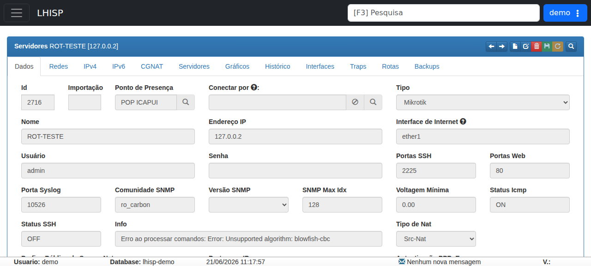

# Servidores

!!! warning "Rascunho gerado por agente"
    Este documento foi produzido a partir da exploração da wiki do LHISP. A etapa atual cobre a leitura da página de **Servidores** e o início da migração para a documentação local. Antes de usar como referência operacional definitiva, a equipe técnica deve validar as regras e os campos observados.

## Objetivo

Entender a página **Servidores** da wiki e registrar, de forma estruturada, como o módulo organiza o cadastro e o acompanhamento de ativos de rede com endereço IP.

## Quando usar

Use este fluxo para:

- consultar a explicação oficial da página **Servidores**;
- iniciar o cadastro de um servidor/ativo de rede;
- revisar os campos exigidos para comunicação, monitoramento e integrações;
- entender como o sistema trata comunicação direta, redirecionamentos, monitoramento, backups e interfaces.

## Pré-requisitos

- Acesso ao menu **Rede/Infra**.
- Permissão para consultar e editar a página de servidores.
- Existência prévia de um **Ponto de Presença**.
- Dados fictícios quando a validação ocorrer em ambiente de demonstração.

## Estrutura da página observada

A página mostra as seguintes seções principais:

1. **Cadastro**
2. **Requerimentos**
3. **Campos**
4. **Comunicação com o Sistema**
5. **Funcionalidades**

No índice lateral da própria página também aparecem os tópicos:

- Cadastro
- Requerimentos
- Campos
- Comunicação com o Sistema
- Direta - Ip Público
- Direta - Ip Privado
- Redirecionamento Manual
- Redirecionamento Via Sistema
- Funcionalidades
- Monitoramento
- Gráficos
- Backups
- Interfaces
- Histórico

## Passo a passo

1. Abra a wiki do LHISP.
2. No menu lateral, entre em **Rede/Infra**.
3. Clique em **Servidores**.
4. Leia a introdução da página para entender o propósito do cadastro.
5. Verifique o bloco **Cadastro**, que orienta o uso do **Formulário Padrão** e do botão **Novo**.
6. Consulte a seção **Requerimentos** para confirmar dependências.
7. Revise a lista de **Campos** para entender os dados necessários.
8. Observe a seção **Comunicação com o Sistema** para entender as formas de conexão.
9. Observe a seção **Funcionalidades** para conhecer o que o módulo habilita após o cadastro.

## Campos e pontos importantes observados

### Cadastro

A própria wiki informa que o cadastro de servidores é feito por um **Formulário Padrão** e que um novo registro é criado pelo botão **Novo** na barra de ferramentas.

### Requerimentos

A página informa que é necessário ter previamente cadastrado um **Ponto de Presença**.

### Campos principais

| Campo | Observação na wiki |
|---|---|
| **Ponto de Presença** | campo requerido; define onde o servidor está localizado |
| **Conectar por** | aponta para outro servidor usado em redirecionamento de portas |
| **Nome** | requerido; identifica o servidor |
| **Tipo** | requerido; representa modelo/fabricante do equipamento |
| **Interface de Internet** | interface de entrada da internet; obrigatória em cenários Mikrotik com autenticação |
| **Usuário** | requerido; credencial de acesso ao equipamento |
| **Senha** | requerida; senha de acesso ao equipamento |
| **Portas SSH/Web** | indica as portas de acesso ao equipamento; SSH é crítica para configuração e backup |
| **Comunidade SNMP** | usada para consultas SNMP, gráficos e listagem de interfaces |
| **Voltagem Mínima** | usada para monitoramento de energia em equipamentos compatíveis |
| **Ativo** | sinaliza que o servidor está ativo e deve ser monitorado/configurado |
| **Servidor de Acesso / PPPoE** | indica que o servidor atua como NAS para autenticação e controle de clientes |
| **Usar Radius** | somente Mikrotik; faz o equipamento consultar o sistema na autenticação |
| **IP Dinâmico** | somente Mikrotik; atualiza o IP com base em logs do equipamento |
| **Servidor DNS** | somente Mikrotik; habilita o uso do equipamento como servidor DNS |

### Comunicação com o Sistema

A página lista quatro cenários de comunicação:

- **Direta - Ip Público**
- **Direta - Ip Privado**
- **Redirecionamento Manual**
- **Redirecionamento Via Sistema**

### Funcionalidades

A wiki associa ao módulo as seguintes funcionalidades:

- Monitoramento
- ICMP
- Energia
- Gráficos
- Backups
- Interfaces
- Histórico

## Resultado esperado

- O usuário entende que a página **Servidores** concentra o cadastro e a operação dos ativos de rede.
- A documentação local passa a ter a primeira referência migrada da wiki.
- Fica mais fácil continuar a migração dos demais itens de **Rede/Infra** com o mesmo padrão.

## Problemas comuns

| Problema | Como tratar |
|---|---|
| Não aparece a opção de criar servidor | Verifique se o usuário possui permissão para editar o módulo. |
| O formulário não pode ser aberto | Confirme se está no contexto correto de **Rede/Infra**. |
| Falta um **Ponto de Presença** | Cadastre o POP antes de seguir com o servidor. |
| Campos de comunicação/funcionalidade não fazem sentido | Revise o tipo de equipamento e a forma de conexão prevista para o cenário. |

## Observações

- A página da wiki é mais ampla que um simples formulário; ela funciona como referência operacional do módulo **Servidores**.
- O conteúdo observado reforça que o cadastro impacta monitoramento, gráficos, backups e rotinas de integração.
- A exploração desta página já serviu como base para a primeira migração documental do repositório.

## Dúvidas para revisão

- A seção **Conectar por** é obrigatória em quais cenários?
- O botão **Novo** leva ao mesmo formulário descrito em outras páginas do módulo ou a um formulário mais enxuto?
- Quais campos são obrigatórios além dos que a wiki marca explicitamente como requeridos?
- A página de **Servidores** e o fluxo de **Cadastrar servidor** devem permanecer como documentos separados ou serão unificados na próxima rodada de migração?

## Screenshots sugeridos

- Página **Servidores** no demo: `docs/assets/screenshots/rede-infra/servidores.png`

