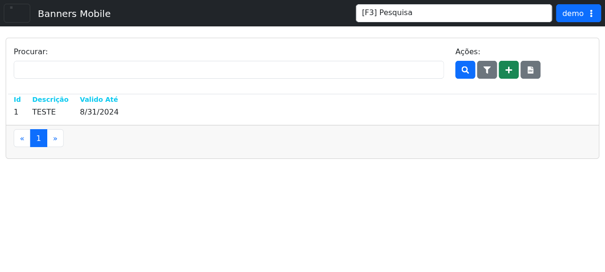

# Banners Mobile

## Objetivo

Gerenciar banners exibidos no aplicativo móvel do LHISP.

## Quando usar

Use esta tela para cadastrar, pesquisar, filtrar e revisar banners móveis ativos.

## Pré-requisitos

- Acesso ao menu **Sistema > Banners Mobile**.
- Permissão para cadastrar ou editar banners.

## Passo a passo

1. Acesse **Sistema > Banners Mobile**.
2. Use o campo **Procurar** para localizar banners.
3. Clique em **Procurar** para aplicar a busca.
4. Clique em **Aplicar Filtros** para refinar a listagem.
5. Clique em **Cadastrar** para criar um novo banner.
6. Clique em **Baixar Planilha** para exportar os registros.

## Campos importantes

| Elemento | Descrição |
|---|---|
| **Procurar** | Campo de pesquisa da listagem. |
| **Procurar** | Botão que executa a busca. |
| **Aplicar Filtros** | Aplica filtros adicionais da listagem. |
| **Cadastrar** | Cria um novo banner mobile. |
| **Baixar Planilha** | Exporta os banners para planilha. |
| **Id** | Identificador do banner. |
| **Descrição** | Descrição do banner. |
| **Válido Até** | Data de expiração do banner. |

## Resultado esperado

- A lista de banners aparece filtrada conforme os critérios informados.
- O usuário consegue cadastrar e exportar banners.

## Problemas comuns

| Problema | Como tratar |
|---|---|
| Nenhum resultado encontrado | Revise a busca e os filtros. |
| Botão de cadastro não abre | Verifique a permissão do usuário. |
| Exportação não gera arquivo | Tente novamente e verifique a conexão. |

## Observações

- O demo mostra uma listagem com colunas **Id**, **Descrição** e **Válido Até**.
- A ação principal exibida é o gerenciamento dos banners e sua exportação.

## Dúvidas para revisão

- Existem regras de imagem/tamanho para o banner mobile?
- O botão de filtro abre quais critérios adicionais?

## Screenshots sugeridos

- `docs/assets/screenshots/sistema/banners-mobile.png` — captura limpa da tela de banners mobile no demo.

