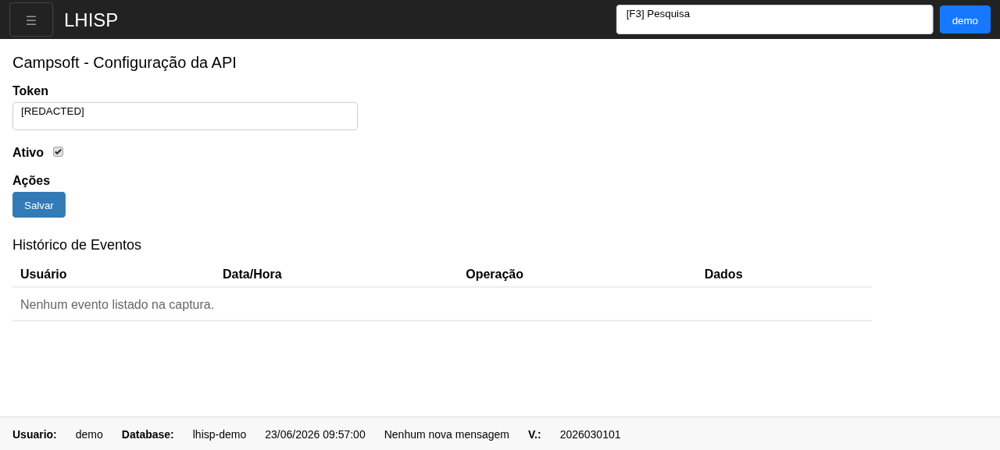

# CampSoft

## Objetivo

Configurar a integração com a API da CampSoft e acompanhar o histórico de eventos.

## Quando usar

Use esta tela quando for necessário habilitar, revisar ou salvar a configuração da integração CampSoft.

## Pré-requisitos

- Acesso ao menu **Sistema > Integrações > CampSoft**.
- Permissão para editar a integração.

## Passo a passo

1. Acesse **Sistema > Integrações > CampSoft**.
2. Revise o campo **Token**.
3. Verifique se a integração está marcada como **Ativo**.
4. Clique em **Salvar** para persistir as alterações.
5. Consulte o **Histórico de Eventos** para acompanhar operações registradas.

## Campos importantes

| Elemento | Descrição |
|---|---|
| **Token** | Chave da integração com a API CampSoft. |
| **Ativo** | Habilita ou desabilita a integração. |
| **Salvar** | Grava a configuração. |
| **Histórico de Eventos** | Lista de operações realizadas na integração. |

## Resultado esperado

- A configuração da API fica salva com sucesso.
- O histórico de eventos fica disponível para consulta.

## Problemas comuns

| Problema | Como tratar |
|---|---|
| Token inválido | Revisar a chave informada. |
| Integração desativada | Marcar a opção **Ativo**. |
| Sem eventos listados | Verificar se já houve operações registradas. |

## Observações

- O token exibido no demo foi **redigido** na captura desta documentação por ser um dado sensível.
- A tela mostra a configuração da API e o histórico de eventos.

## Dúvidas para revisão

- O token é único por empresa ou por filial?
- Quais eventos são gravados no histórico?

## Screenshots sugeridos

- `docs/assets/screenshots/sistema/campsoft.png` — captura limpa da configuração da API CampSoft com token redigido.

