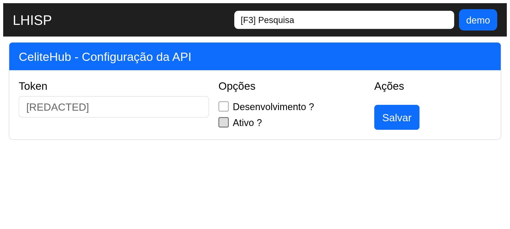

# CeliteHub

!!! warning "Rascunho gerado por agente"
    Este documento foi produzido a partir da exploração da wiki do LHISP e da tela equivalente no ambiente de demonstração. O token exibido no demo foi redigido na captura desta documentação.

## Objetivo

Configurar a integração com **CeliteHub** para informar o token de acesso, controlar o modo de desenvolvimento e habilitar a API.

## Quando usar

Use esta tela quando for necessário:

- informar o token da integração;
- ativar ou desativar o ambiente de desenvolvimento;
- habilitar a integração no LHISP.

## Pré-requisitos

- Acesso ao menu **Sistema > Integrações > CelitHub** no demo.
- Token de acesso fornecido pela plataforma CeliteHub.
- Permissão para editar a integração.

## Passo a passo

1. Acesse **Sistema > Integrações > CelitHub**.
2. Preencha o **Token** fornecido pela plataforma.
3. Marque **Desenvolvimento ?** se estiver em ambiente de testes.
4. Marque **Ativo ?** quando a integração estiver pronta para uso.
5. Clique em **Salvar**.

## Campos importantes

| Campo / ação | Descrição |
|---|---|
| **Token** | Chave de autenticação da API. |
| **Desenvolvimento ?** | Indica se a integração está em modo de testes. |
| **Ativo ?** | Liga ou desliga a integração. |
| **Salvar** | Persiste a configuração atual. |

## Resultado esperado

- A integração fica configurada com o token correto.
- O modo de desenvolvimento pode ser ajustado conforme o ambiente.
- A integração passa a ficar disponível quando ativada.

## Problemas comuns

| Problema | Como tratar |
|---|---|
| Token inválido | Revisar o valor informado antes de salvar. |
| Integração em modo errado | Ajustar a opção **Desenvolvimento ?** conforme o ambiente. |
| Integração desativada | Marcar a opção **Ativo ?** quando necessário. |

## Observações

- No demo, a tela aparece como **CeliteHub - Configuração da API**.
- O token visível no demo foi redigido na captura publicada.
- A captura desta página foi feita no ambiente de demonstração.

## Dúvidas para revisão

- A grafia oficial no menu deve ficar como **CelitHub** ou **CeliteHub** na documentação pública?
- O campo **Desenvolvimento ?** tem impacto em outros fluxos além da API principal?

## Screenshots sugeridos

- `docs/assets/screenshots/sistema/celitehub.png` — captura limpa da tela CeliteHub no demo.

