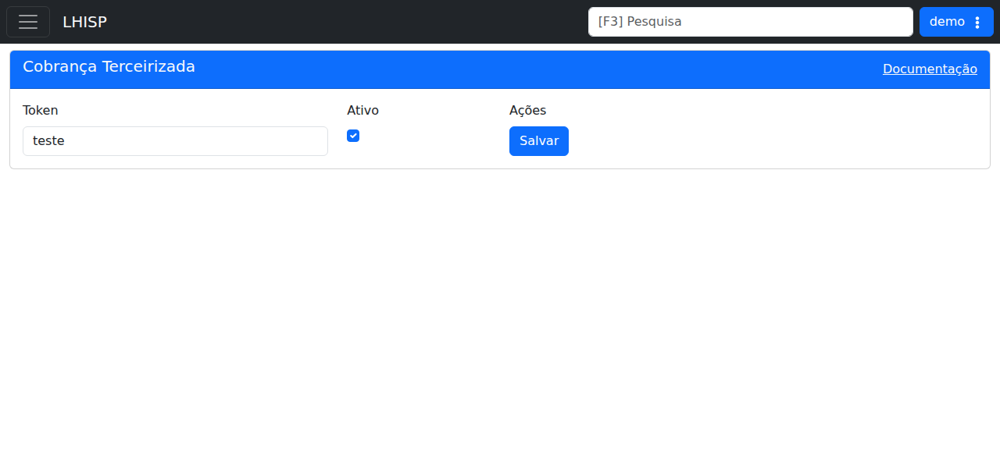

# Cobrança Terceirizada

!!! warning "Rascunho gerado por agente"
    Este documento foi produzido a partir da exploração da wiki do LHISP e da tela equivalente no ambiente de demonstração. O token exibido no demo é apenas ilustrativo do ambiente de teste e não deve ser reutilizado em produção.

## Objetivo

Configurar a integração de **Cobrança Terceirizada** para ativar a comunicação com a empresa terceirizada, gerar token e habilitar o fluxo de cobrança e conferência.

## Quando usar

Use este fluxo quando for necessário:

- ativar ou desativar a integração;
- gerar ou revisar o token de autenticação;
- liberar a conferência de clientes em cobrança terceirizada;
- consultar os endpoints expostos para a empresa parceira.

## Pré-requisitos

- Acesso ao menu **Sistema > Integrações > CobrancaTerceirizada**.
- Permissão para alterar integrações e visualizar relatórios.
- Definição da empresa terceirizada que fará a chamada.

## Passo a passo

1. Acesse **Sistema > Integrações > CobrancaTerceirizada**.
2. Verifique o **Token** gerado na configuração.
3. Marque ou desmarque a opção **Ativo** conforme a necessidade.
4. Clique em **Salvar**.
5. Se necessário, consulte os endpoints documentados na wiki para integrar o sistema externo.
6. Acompanhe os clientes marcados como cobrança terceirizada no relatório correspondente.

## Campos importantes

| Campo / ação | Descrição |
|---|---|
| **Token** | Chave usada pela empresa terceirizada na autenticação. |
| **Ativo** | Liga ou desliga a integração. |
| **Salvar** | Persiste a configuração. |
| **Documentação** | Acesso rápido à documentação da integração. |

## Resultado esperado

- O token fica associado à integração.
- A empresa terceirizada consegue consumir os endpoints documentados.
- Os clientes chamados ficam disponíveis para conferência no relatório de cobrança terceirizada.

## Problemas comuns

| Problema | Como tratar |
|---|---|
| O token não é aceito | Verifique se o valor foi copiado corretamente e se a autenticação usa o header esperado. |
| A integração não fica ativa | Confirme se a opção **Ativo** foi marcada antes de salvar. |
| O relatório não mostra os clientes esperados | Verifique se o endpoint de listagem foi chamado corretamente pela empresa terceirizada. |
| A documentação não abre | Consulte a wiki para recuperar os endpoints e exemplos de chamada. |

## Observações

- A wiki informa que a integração usa um token gerado na sessão de ativação.
- A wiki descreve dois endpoints principais: **listar clientes para cobrança** e **listagem de pagamentos**.
- A autenticação é feita via token enviado no header.
- A wiki também informa que os clientes chamados ficam marcados como **Em Cobrança terceirizada** e podem ser conferidos em relatório próprio.
- A captura usada nesta página veio do ambiente de demonstração, não da wiki.

## Dúvidas para revisão

- O nome oficial no menu deve permanecer como **CobrancaTerceirizada** ou com espaço/acentuação?
- O relatório correspondente deve virar uma página separada na documentação?
- O endpoint de pagamentos tem retorno padronizado ou varia por parceiro?

## Screenshots sugeridos

- Tela **Cobrança Terceirizada** no demo: `docs/assets/screenshots/sistema/cobranca-terceirizada.png`

