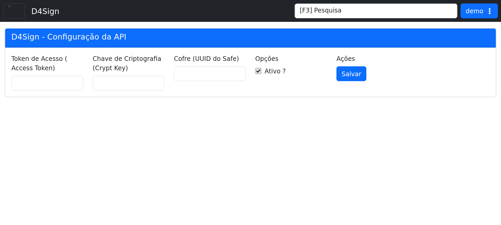

# D4Sign

## Objetivo

Configurar a integração com o D4Sign e acompanhar o histórico de eventos da API.

## Quando usar

Use esta tela quando for necessário informar credenciais do D4Sign, habilitar a integração ou revisar os eventos registrados.

## Pré-requisitos

- Acesso ao menu **Sistema > Integrações > D4Sign**.
- Permissão para editar a integração.

## Passo a passo

1. Acesse **Sistema > Integrações > D4Sign**.
2. Informe o **Token de Acesso (Access Token)**.
3. Informe a **Chave de Criptografia (Crypt Key)**.
4. Informe o **Cofre (UUID do Safe)**.
5. Verifique a opção **Ativo ?**.
6. Clique em **Salvar** para persistir as alterações.
7. Consulte o **Histórico de Eventos** quando houver registros disponíveis.

## Campos importantes

| Campo / ação | Descrição |
|---|---|
| **Token de Acesso** | Token de autenticação da integração D4Sign. |
| **Chave de Criptografia** | Chave usada para operações criptográficas da integração. |
| **Cofre (UUID do Safe)** | Identificador do cofre no D4Sign. |
| **Ativo ?** | Habilita ou desabilita a integração. |
| **Salvar** | Grava a configuração atual. |
| **Histórico de Eventos** | Lista de operações registradas pela integração. |

## Resultado esperado

- A integração fica configurada com os dados corretos do D4Sign.
- O histórico passa a refletir as operações processadas pela integração.

## Problemas comuns

| Problema | Como tratar |
|---|---|
| Token ausente | Preencha o token de acesso correto. |
| Chave de criptografia inválida | Revisar a chave informada antes de salvar. |
| Cofre incorreto | Confirmar o UUID do safe no D4Sign. |
| Integração desativada | Manter a opção **Ativo ?** selecionada quando necessário. |

## Observações

- A tela do demo exibe a configuração completa da integração D4Sign.
- Os rótulos aparecem com o texto **Access Token** e **Crypt Key** entre parênteses na interface.
- A captura desta página foi feita no ambiente de demonstração.

## Dúvidas para revisão

- A opção **Ativo ?** deve permanecer marcada por padrão no ambiente produtivo?
- O campo **Cofre (UUID do Safe)** é obrigatório em todos os cenários?

## Screenshots sugeridos

- `docs/assets/screenshots/sistema/d4sign.png` — captura limpa da tela D4Sign no demo.

