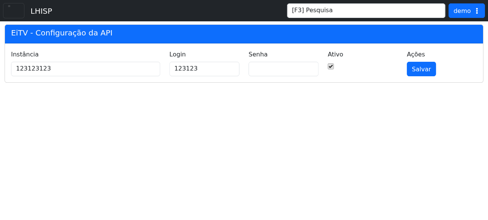

# EiTV

## Objetivo

Configurar a integração com a API da EiTV para o ambiente do LHISP.

## Quando usar

Use esta tela para revisar ou ajustar os dados de acesso da integração EiTV.

## Pré-requisitos

- Acesso ao menu **Sistema > Integrações > EiTV**.
- Permissão para editar a integração.

## Passo a passo

1. Acesse **Sistema > Integrações > EiTV**.
2. Revise os campos **Instância**, **Login** e **Senha**.
3. Verifique se a integração está marcada como **Ativo**.
4. Clique em **Salvar** para gravar as alterações.

## Campos importantes

| Elemento | Descrição |
|---|---|
| **Instância** | Identificador da instância da EiTV. |
| **Login** | Usuário de acesso à API. |
| **Senha** | Senha de acesso à API. |
| **Ativo** | Habilita ou desabilita a integração. |
| **Salvar** | Grava a configuração. |

## Resultado esperado

- A configuração da EiTV fica salva com sucesso.
- A integração permanece ativa quando o checkbox estiver marcado.

## Problemas comuns

| Problema | Como tratar |
|---|---|
| Credenciais inválidas | Revisar instância, login e senha. |
| Integração desativada | Marcar a opção **Ativo**. |
| Falha ao salvar | Verificar conexão e permissões do usuário. |

## Observações

- A tela do demo mostra apenas o formulário de configuração da API.
- Os campos de **Instância** e **Login** já aparecem preenchidos na captura.

## Dúvidas para revisão

- A **Instância** é obrigatória em todos os ambientes?
- Há validação de formato para o login?
- Existem parâmetros adicionais além dos exibidos na tela?

## Screenshots sugeridos

- `docs/assets/screenshots/sistema/eitv.png` — captura limpa da configuração da API EiTV no demo.

