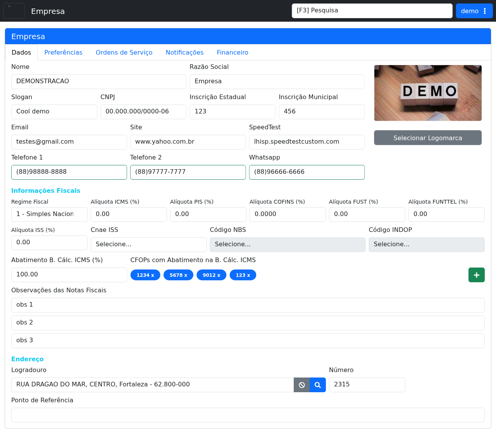

# Empresa

!!! warning "Rascunho gerado por agente"
    Esta página foi documentada a partir da tela equivalente no ambiente de demonstração do LHISP. Os dados exibidos no demo são apenas ilustrativos do tenant de teste.

## Objetivo

Consultar e manter os dados cadastrais e fiscais da empresa no LHISP, incluindo informações de identificação, contato, logomarca e parâmetros fiscais usados pelo sistema.

## Quando usar

Use esta tela quando for necessário:

- revisar os dados cadastrais da empresa;
- atualizar nome, razão social, CNPJ e contatos;
- ajustar parâmetros fiscais;
- conferir informações de endereço e observações fiscais;
- trocar a logomarca exibida no sistema.

## Pré-requisitos

- Acesso ao menu **Sistema > Empresa**.
- Permissão para alterar dados cadastrais da empresa.

## Passo a passo

1. Acesse **Sistema > Empresa**.
2. Abra a aba **Dados** para consultar os campos cadastrais.
3. Revise as informações de identificação, contato e endereço.
4. Verifique a seção **Informações Fiscais** para conferir os parâmetros tributários.
5. Use **Selecionar Logomarca** quando for necessário trocar a imagem da empresa.
6. Se necessário, navegue para as demais abas para revisar configurações complementares da empresa.

## Campos importantes

### Aba Dados

| Campo / ação | Descrição |
|---|---|
| **Nome** | Nome de exibição da empresa no sistema. |
| **Razão Social** | Razão social cadastrada. |
| **Slogan** | Texto institucional exibido na empresa. |
| **CNPJ** | Documento fiscal da empresa. |
| **Inscrição Estadual** | Inscrição estadual informada no cadastro. |
| **Inscrição Municipal** | Inscrição municipal da empresa. |
| **Email** | Endereço eletrônico principal. |
| **Site** | Site institucional. |
| **SpeedTest** | Endereço usado para o teste de velocidade. |
| **Telefone 1 / Telefone 2 / Whatsapp** | Canais de contato da empresa. |
| **Selecionar Logomarca** | Abre a seleção da imagem da marca. |
| **Regime Fiscal** | Regime tributário da empresa. |
| **Alíquota ICMS / PIS / COFINS / FUST / FUNTTEL / ISS** | Parâmetros fiscais exibidos na tela. |
| **Cnae ISS** | CNAE vinculado ao ISS. |
| **Código NBS** | Código fiscal complementar. |
| **Código INDOP** | Código fiscal complementar. |
| **Abatimento B. Cálc. ICMS (%)** | Percentual de abatimento da base de cálculo do ICMS. |
| **CFOPs com Abatimento na B. Cálc. ICMS** | Lista de CFOPs vinculados ao abatimento. |
| **Observações das Notas Fiscais** | Campo com observações fiscais em múltiplas linhas. |
| **Logradouro / Número / Ponto de Referência** | Dados de endereço exibidos no cadastro. |

## Resultado esperado

- Os dados da empresa ficam disponíveis para consulta e manutenção.
- A logomarca e os parâmetros fiscais podem ser revisados em um único local.
- O cadastro central da empresa permanece alinhado ao uso pelo restante do sistema.

## Problemas comuns

| Problema | Como tratar |
|---|---|
| Os campos não refletem a realidade da empresa | Verifique se o ambiente está apontando para o tenant correto. |
| A logomarca não carrega | Refaça o upload e confirme o formato da imagem. |
| Os dados fiscais parecem inconsistentes | Confirme com o time fiscal antes de salvar qualquer alteração. |
| A aba desejada não abre | Recarregue a página e teste novamente com outra sessão. |

## Observações

- O demo abre a tela **Empresa** com a aba **Dados** selecionada por padrão.
- As abas visíveis no demo incluem **Dados**, **Preferências**, **Ordens de Serviço**, **Notificações** e **Financeiro**.
- A captura usada nesta página foi feita no ambiente de demonstração e está sem marcações visuais.
- O formulário do demo já vem preenchido com dados ilustrativos do tenant de teste.

## Dúvidas para revisão

- As alterações nesta tela exigem um botão de **Salvar** fora da área visível do screenshot?
- As abas **Preferências**, **Ordens de Serviço**, **Notificações** e **Financeiro** devem virar páginas próprias ou permanecer como subseções desta página?
- O campo **SpeedTest** possui alguma validação específica?
- O bloco de observações fiscais é usado em quais documentos de saída?

## Screenshots sugeridos

- Tela **Empresa > Dados** no demo: `docs/assets/screenshots/sistema/empresa.png`

