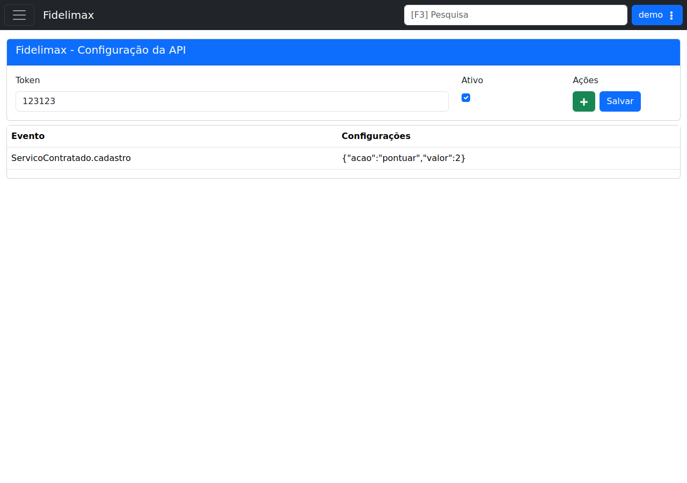

# Fidelimax

!!! warning "Rascunho gerado por agente"
    Esta página foi produzida a partir da tela observada no ambiente de demonstração do LHISP. A captura usada aqui foi validada visualmente e mostra a configuração da API do Fidelimax.

## Objetivo

Registrar a integração **Fidelimax** usada pelo LHISP para configurar token, ativação e eventos associados à API.

## Quando usar

Use esta tela para:

- cadastrar ou revisar o token de integração;
- ativar ou desativar o uso da API;
- manter eventos vinculados à integração;
- revisar a regra de pontuação aplicada ao evento cadastrado.

## Pré-requisitos

- Acesso ao menu **Sistema > Integrações > Fidelimax**.
- Permissão para consultar ou alterar a configuração da API.
- Token de integração informado pela Fidelimax.

## Passo a passo

1. Acesse **Sistema > Integrações > Fidelimax**.
2. Revise o campo **Token**.
3. Verifique se a opção **Ativo** está marcada conforme o ambiente.
4. Use **Adicionar Evento** para incluir novas regras, se necessário.
5. Clique em **Salvar** para persistir a configuração.
6. Confira a tabela de eventos cadastrados e a estrutura de cada configuração.

## Campos importantes

| Campo / elemento | Observação |
|---|---|
| **Token** | Chave de autenticação da integração. |
| **Ativo** | Define se a integração está habilitada. |
| **Adicionar Evento** | Botão para inserir eventos associados. |
| **Salvar** | Persiste a configuração. |
| **Evento** | Nome do evento associado. |
| **Configurações** | JSON com a regra aplicada ao evento. |

## Resultado esperado

- A API Fidelimax fica autenticada com o token correto.
- A integração pode ser ligada ou desligada por ambiente.
- Os eventos cadastrados ficam visíveis na grade inferior.

## Problemas comuns

| Problema | Como tratar |
|---|---|
| Token inválido | Confirme o valor fornecido pela Fidelimax. |
| Evento não processa | Revise a configuração JSON na tabela de eventos. |
| Integração desativada | Verifique se **Ativo** está marcado. |
| Não consigo salvar | Confira permissões e validade dos campos. |

## Observações

- A captura do demo estava limpa e sem marcações visuais.
- O evento já cadastrado no demo é `ServicoContratado.cadastro`.
- A configuração visível do evento usa o JSON `{"acao":"pontuar","valor":2}`.
- A tela exibida no demo é uma página direta de configuração, sem etapas intermediárias.

## Dúvidas para revisão

- A configuração por evento aceita mais de uma ação simultânea?
- A regra de `pontuar` é exclusiva do evento de cadastro de serviço contratado?
- O botão **Adicionar Evento** abre um formulário modal ou uma linha editável na tabela?

## Screenshots sugeridos

- Tela principal de **Fidelimax** no demo: `docs/assets/screenshots/sistema/fidelimax.png`

