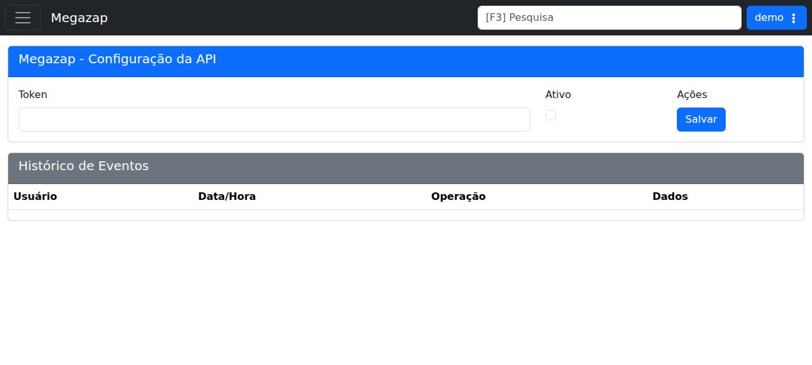

# Megazap

!!! warning "Rascunho gerado por agente"
    Este documento foi produzido a partir da exploração da wiki do LHISP e da tela equivalente no ambiente de demonstração. O token exibido no demo é apenas ilustrativo do ambiente de teste e não deve ser reutilizado em produção.

## Objetivo

Configurar a integração com **Megazap** para geração de token, ativação da API e uso dos callbacks de ações disponíveis no sistema.

## Quando usar

Use este fluxo quando for necessário:

- gerar ou revisar o token da integração;
- ativar ou desativar a API;
- integrar callbacks para ações como financeiro, atendimento e agendamentos;
- consultar o histórico de eventos da integração.

## Pré-requisitos

- Acesso ao menu **Sistema > Integrações > Megazap**.
- Permissão para alterar integrações.
- Conhecer o `Id da Sua Empresa` usado nos callbacks.

## Passo a passo

1. Acesse **Sistema > Integrações > Megazap**.
2. Verifique o **Token** da integração.
3. Marque a opção **Ativo** quando a API estiver pronta para uso.
4. Clique em **Salvar**.
5. Use a URL base e o token para integrar os callbacks do Megazap.
6. Consulte o histórico de eventos para acompanhar alterações na integração.

## Campos importantes

| Campo / ação | Descrição |
|---|---|
| **Token** | Token gerado na tela de integração. |
| **Ativo** | Liga ou desliga a integração. |
| **Salvar** | Persiste a configuração. |
| **Histórico de Eventos** | Registra alterações e operações da integração. |

## Resultado esperado

- O token fica associado à integração.
- A API passa a responder aos callbacks configurados.
- O histórico registra as operações realizadas.

## Problemas comuns

| Problema | Como tratar |
|---|---|
| O callback não responde | Confirme a URL base e o `Id da Sua Empresa` enviados pelo sistema externo. |
| O token não funciona | Verifique se a integração foi salva e se a opção **Ativo** está marcada. |
| A ação não é reconhecida | Revise o nome da ação configurada no callback. |
| O histórico não mostra registros | Confirme se houve chamadas recentes à integração. |

## Observações

- A wiki informa que a URL base usa a URL do LHISP, o `Id da Sua Empresa`, a ação e o token do Megazap.
- A wiki lista ações como `financeiro`, `desbloqueioEmConfianca`, `atendimento` e `mensagemAgendada`.
- A wiki fornece callbacks de exemplo para cada ação.
- O demo mostra a tela **Megazap - Configuração da API** com token, ativação e histórico de eventos.
- A captura usada nesta página veio do ambiente de demonstração, não da wiki.

## Dúvidas para revisão

- A URL base deve ser documentada com um exemplo único ou com todas as variações de callback?
- O nome da ação `desbloqueioEmConfianca` é o identificador oficial ou existe um nome legível equivalente?
- O histórico de eventos possui filtros adicionais que devem ser documentados em outra página?

## Screenshots sugeridos

- Tela **Megazap - Configuração da API** no demo: `docs/assets/screenshots/sistema/megazap.png`

