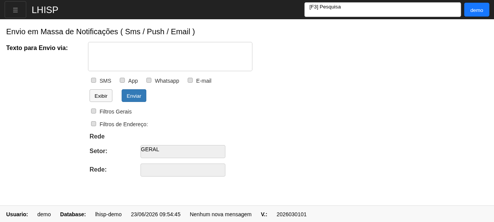

# Notificações em Massa

## Objetivo

Enviar mensagens em massa pelo LHISP usando canais como SMS, App, Whatsapp e E-mail.

## Quando usar

Use esta tela quando for necessário disparar um comunicado para um conjunto de clientes ou contatos.

## Pré-requisitos

- Acesso ao menu **Sistema > Notificações em Massa**.
- Permissão para enviar notificações.
- Texto da mensagem pronto para envio.

## Passo a passo

1. Acesse **Sistema > Notificações em Massa**.
2. Preencha o campo **Texto para Envio via:**.
3. Marque os canais desejados:
   - **SMS**
   - **App**
   - **Whatsapp**
   - **E-mail**
4. Clique em **Exibir** para revisar a seleção.
5. Ajuste os filtros, se necessário.
6. Clique em **Enviar** para disparar a mensagem.

## Campos importantes

| Elemento | Descrição |
|---|---|
| **Texto para Envio via:** | Texto principal da notificação em massa. |
| **SMS / App / Whatsapp / E-mail** | Canais disponíveis para envio. |
| **Exibir** | Mostra a pré-visualização/seleção atual. |
| **Enviar** | Executa o envio da notificação. |
| **Filtros Gerais** | Habilita filtros gerais de seleção. |
| **Filtros de Endereço** | Habilita filtros por endereço/rede. |
| **Setor** | Define o setor alvo. |
| **Rede** | Define a rede alvo. |

## Resultado esperado

- A mensagem é preparada com o canal correto.
- Os filtros e o escopo de envio são aplicados antes do disparo.
- O envio é realizado para o público escolhido.

## Problemas comuns

| Problema | Como tratar |
|---|---|
| Nenhum canal selecionado | Marque ao menos um canal de envio. |
| Mensagem vazia | Preencha o texto antes de enviar. |
| Filtros sem resultado | Revise setor, rede e demais critérios. |

## Observações

- A tela verificada no demo mostra o cabeçalho **Envio em Massa de Notificações ( Sms / Push / Email )**.
- O fluxo exibido contém filtros gerais e filtros por endereço.
- A captura foi feita no demo e validada visualmente.

## Dúvidas para revisão

- O canal **App** corresponde a push notification?
- O campo **Rede** depende obrigatoriamente do **Setor**?
- Há limite de tamanho para o texto da mensagem?

## Screenshots sugeridos

- `docs/assets/screenshots/sistema/notificacoes-em-massa.png` — captura limpa da tela de envio em massa no demo.

