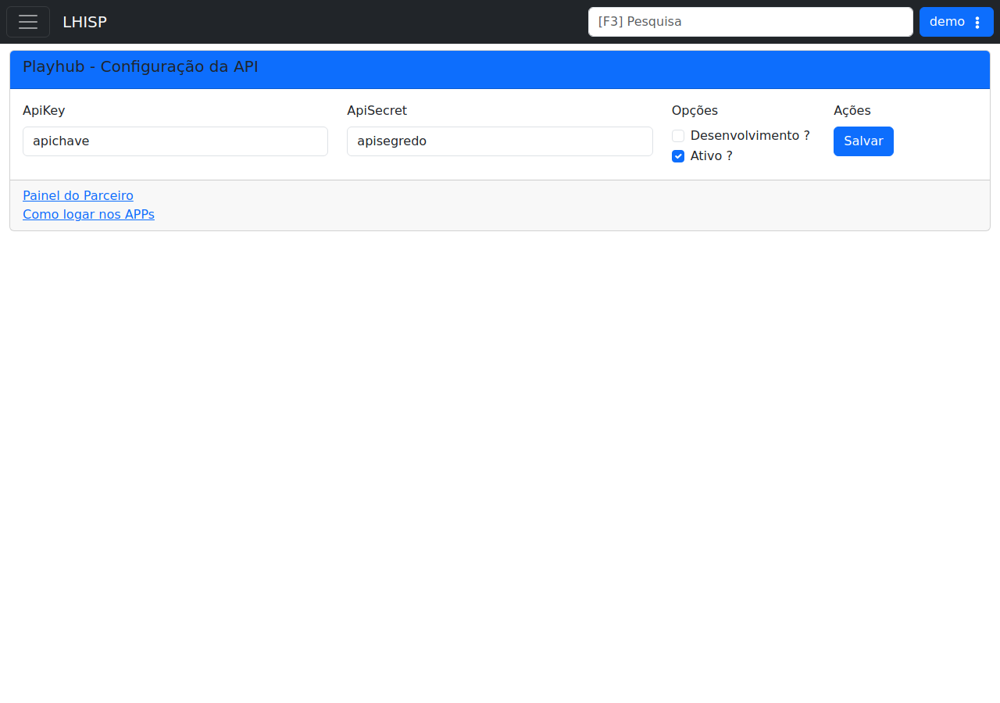

# PlayHub

!!! warning "Rascunho gerado por agente"
    Esta página foi produzida a partir da tela observada no ambiente de demonstração do LHISP. A captura usada aqui foi validada visualmente e mostra a configuração da API do PlayHub.

## Objetivo

Registrar a integração **PlayHub**, usada para configurar credenciais, ambiente de desenvolvimento e ativação da conta.

## Quando usar

Use esta tela para:

- informar a `ApiKey` e o `ApiSecret` da integração;
- alternar entre ambiente de desenvolvimento e produção;
- ativar ou desativar a integração;
- acessar os links auxiliares do parceiro.

## Pré-requisitos

- Acesso ao menu **Sistema > Integrações > PlayHub**.
- Credenciais da PlayHub fornecidas para o ambiente.
- Permissão para consultar ou alterar a configuração da API.

## Passo a passo

1. Acesse **Sistema > Integrações > PlayHub**.
2. Preencha **ApiKey** e **ApiSecret**.
3. Revise as opções **Desenvolvimento ?** e **Ativo ?**.
4. Clique em **Salvar** para persistir a configuração.
5. Use os links **Painel do Parceiro** e **Como logar nos APPs** quando precisar consultar a documentação externa.

## Campos importantes

| Campo / elemento | Observação |
|---|---|
| **ApiKey** | Chave pública da integração. |
| **ApiSecret** | Segredo da integração. |
| **Desenvolvimento ?** | Define se o ambiente é de teste. |
| **Ativo ?** | Habilita ou desabilita a integração. |
| **Salvar** | Persiste a configuração. |
| **Painel do Parceiro** | Link auxiliar para o portal externo. |
| **Como logar nos APPs** | Link auxiliar com instruções de acesso. |

## Resultado esperado

- A integração PlayHub fica autenticada com as credenciais corretas.
- O ambiente é definido como desenvolvimento ou produção.
- A integração fica disponível para uso pelo sistema.

## Problemas comuns

| Problema | Como tratar |
|---|---|
| Credenciais inválidas | Confirme ApiKey e ApiSecret com o parceiro. |
| A integração não responde | Verifique se **Ativo ?** está marcado. |
| Ambiente incorreto | Revise a opção de desenvolvimento antes de salvar. |
| Link externo não abre | Verifique acesso de rede e permissões do navegador. |

## Observações

- A captura do demo estava limpa e sem marcações visuais.
- O demo exibiu dois campos de credenciais e duas opções de ambiente/ativação.
- Os valores mostrados no screenshot são ilustrativos do tenant de teste e não foram reproduzidos aqui.
- A tela inclui links auxiliares do parceiro logo abaixo da área principal.

## Dúvidas para revisão

- Os links auxiliares são mantidos pela PlayHub ou pelo time interno?
- A marcação **Desenvolvimento ?** altera apenas o endpoint ou também o comportamento da integração?
- Existem eventos adicionais além dos campos principais exibidos nesta tela?

## Screenshots sugeridos

- Tela principal de **PlayHub** no demo: `docs/assets/screenshots/sistema/playhub.png`

