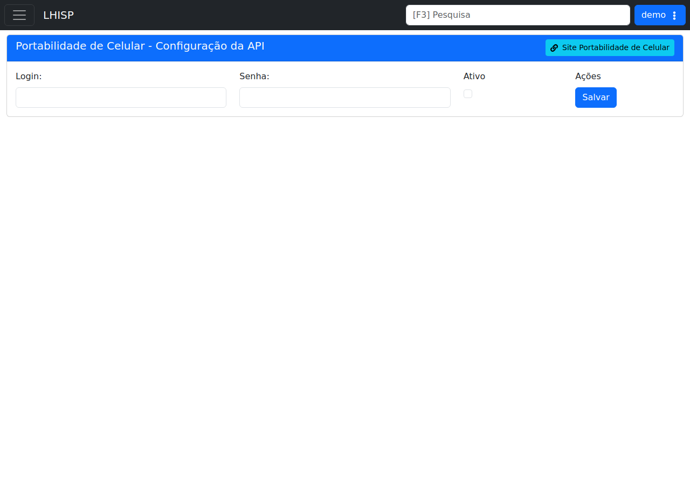

# Portabilidade de Celular

!!! warning "Rascunho gerado por agente"
    Esta página foi produzida a partir da tela observada no ambiente de demonstração do LHISP. A captura usada aqui foi validada visualmente e mostra a configuração da API da Portabilidade de Celular.

## Objetivo

Registrar a integração **Portabilidade de Celular**, usada para configurar login, senha e ativação do serviço.

## Quando usar

Use esta tela para:

- informar as credenciais de acesso;
- ativar ou desativar a integração;
- acessar o site do parceiro;
- salvar a configuração do ambiente.

## Pré-requisitos

- Acesso ao menu **Sistema > Integrações > Portabilidade de Celular**.
- Credenciais de acesso fornecidas pelo parceiro.
- Permissão para consultar ou alterar a configuração da API.

## Passo a passo

1. Acesse **Sistema > Integrações > Portabilidade de Celular**.
2. Preencha **Login** e **Senha**.
3. Verifique se a opção **Ativo** está marcada conforme o ambiente.
4. Clique em **Salvar** para persistir a configuração.
5. Use o link **Site Portabilidade de Celular** para consultar o portal externo, quando necessário.

## Campos importantes

| Campo / elemento | Observação |
|---|---|
| **Login** | Identificador de acesso ao parceiro. |
| **Senha** | Credencial de autenticação. |
| **Ativo** | Habilita ou desabilita a integração. |
| **Salvar** | Persiste a configuração. |
| **Site Portabilidade de Celular** | Link auxiliar para o portal externo. |

## Resultado esperado

- As credenciais ficam cadastradas no sistema.
- A integração pode ser ligada ou desligada por ambiente.
- O portal do parceiro permanece acessível pelo atalho exibido na tela.

## Problemas comuns

| Problema | Como tratar |
|---|---|
| Login ou senha inválidos | Confirme os dados com o parceiro. |
| Integração desativada | Verifique se **Ativo** está marcado. |
| Não consigo salvar | Confira permissões e validade dos campos. |
| Link externo não abre | Verifique conexão e bloqueios do navegador. |

## Observações

- A captura do demo estava limpa e sem marcações visuais.
- A tela é objetiva e contém apenas login, senha, ativação, salvar e atalho externo.
- Os valores sensíveis do demo não foram reproduzidos nesta documentação.

## Dúvidas para revisão

- A integração exige algum parâmetro adicional além de login e senha?
- O site do parceiro é apenas informativo ou também executa alguma ação operacional?
- Há políticas de autenticação ou expiração de senha específicas?

## Screenshots sugeridos

- Tela principal de **Portabilidade de Celular** no demo: `docs/assets/screenshots/sistema/portabilidade-de-celular.png`

