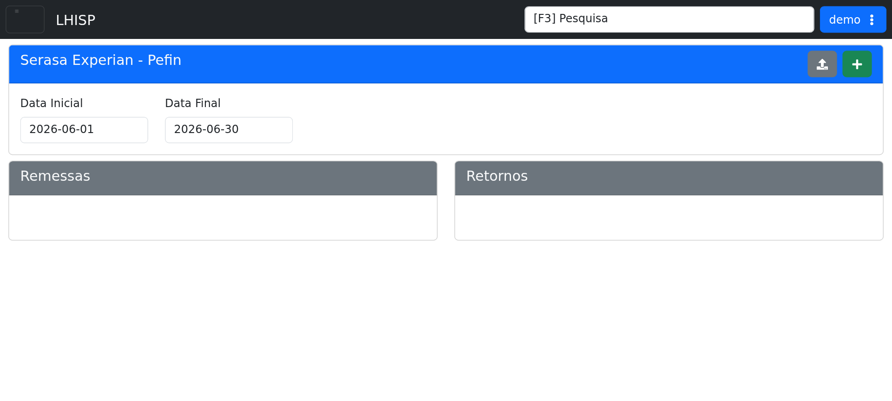

# Serasa Pefin

## Objetivo

Consultar a integração Serasa Experian - Pefin, selecionar período e acompanhar os arquivos de remessa e retorno.

## Quando usar

Use esta tela quando for necessário analisar remessas, retornos ou preparar novos envios para o período selecionado.

## Pré-requisitos

- Acesso ao menu **Sistema > Integrações > Serasa Pefin**.
- Período de consulta definido com datas inicial e final válidas.

## Passo a passo

1. Acesse **Sistema > Integrações > Serasa Pefin**.
2. Informe a **Data Inicial**.
3. Informe a **Data Final**.
4. Use as ações disponíveis no cabeçalho para importar retorno ou adicionar novo item.
5. Consulte os quadros de **Remessas** e **Retornos** para revisar os resultados.

## Campos importantes

| Campo / ação | Descrição |
|---|---|
| **Data Inicial** | Data inicial do período consultado. |
| **Data Final** | Data final do período consultado. |
| **Importar Retorno Pefin** | Ação para importar arquivos de retorno. |
| **Adicionar** | Ação para incluir um novo registro. |
| **Remessas** | Área com os envios registrados no período. |
| **Retornos** | Área com os retornos importados no período. |

## Resultado esperado

- O período selecionado fica visível na tela.
- As seções de remessas e retornos permitem acompanhar os arquivos processados.

## Problemas comuns

| Problema | Como tratar |
|---|---|
| Datas inválidas | Ajustar o intervalo antes de consultar. |
| Nenhum registro exibido | Verificar se há remessas ou retornos para o período selecionado. |
| Importação indisponível | Confirmar permissões e a disponibilidade do arquivo de retorno. |

## Observações

- A tela do demo exibe o nome **Serasa Experian - Pefin**.
- A interface mostra os blocos **Remessas** e **Retornos** em branco quando não há dados.
- A captura desta página foi feita no ambiente de demonstração.

## Dúvidas para revisão

- A ação **Adicionar** cria remessa manual ou outro tipo de registro?
- O importador de retorno exige algum layout específico no arquivo?

## Screenshots sugeridos

- `docs/assets/screenshots/sistema/serasa-pefin.png` — captura limpa da tela Serasa Pefin no demo.

