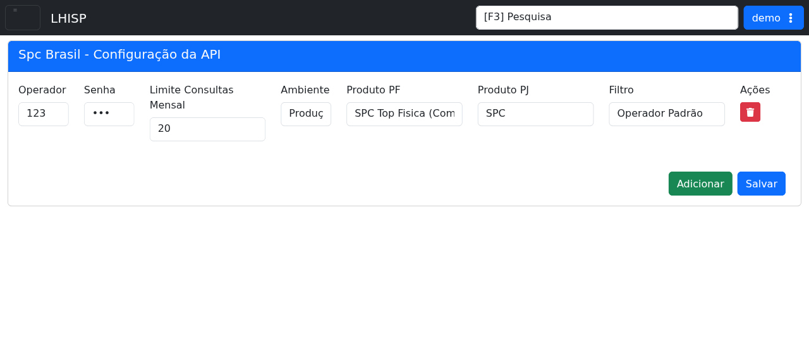

# Spc Brasil

## Objetivo

Configurar a integração com a API do SPC Brasil.

## Quando usar

Use esta tela para revisar credenciais, ambiente, produtos e critérios de filtro da integração.

## Pré-requisitos

- Acesso ao menu **Sistema > Integrações > Spc Brasil**.
- Permissão para editar a configuração.

## Passo a passo

1. Acesse **Sistema > Integrações > Spc Brasil**.
2. Revise os campos **Operador** e **Senha**.
3. Ajuste **Limite Consultas Mensal**, **Ambiente**, **Produto PF**, **Produto PJ** e **Filtro** conforme necessário.
4. Use **Adicionar** para incluir a configuração e **Salvar** para gravar as alterações.
5. Use **Apagar** para remover a configuração atual, se necessário.

## Campos importantes

| Elemento | Descrição |
|---|---|
| **Operador** | Código do operador SPC. |
| **Senha** | Senha de acesso à API. |
| **Limite Consultas Mensal** | Limite mensal de consultas permitido. |
| **Ambiente** | Ambiente de execução da integração. |
| **Produto PF** | Produto configurado para pessoa física. |
| **Produto PJ** | Produto configurado para pessoa jurídica. |
| **Filtro** | Critério de uso da integração. |
| **Adicionar** | Inclui uma configuração. |
| **Salvar** | Grava a configuração. |
| **Apagar** | Remove a configuração atual. |

## Resultado esperado

- A configuração da API fica salva com os parâmetros corretos.
- O ambiente e os produtos ficam alinhados ao uso desejado.

## Problemas comuns

| Problema | Como tratar |
|---|---|
| Credenciais inválidas | Revisar operador e senha. |
| Ambiente incorreto | Ajustar entre produção, homologação ou treinamento. |
| Produto incompatível | Conferir os produtos PF/PJ selecionados. |

## Observações

- A captura do demo mostra a senha mascarada.
- Os campos de produto possuem várias opções de integração SPC.

## Dúvidas para revisão

- O campo **Filtro** é obrigatório para todos os cenários?
- O botão **Adicionar** cria um novo cadastro ou apenas adiciona uma linha?
- Há diferença operacional entre os produtos PF e PJ?

## Screenshots sugeridos

- `docs/assets/screenshots/sistema/spc-brasil.png` — captura limpa da configuração da API SPC Brasil no demo.

