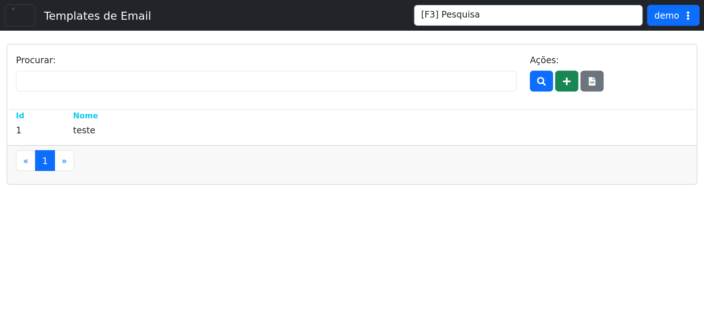

# Templates de Email

## Objetivo

Listar, pesquisar e cadastrar templates de e-mail usados pelo sistema.

## Quando usar

Use esta tela quando for necessário localizar um template existente, criar um novo modelo ou exportar a lista para análise.

## Pré-requisitos

- Acesso ao menu **Sistema > Templates de Email**.
- Permissão para pesquisar e cadastrar templates.

## Passo a passo

1. Acesse **Sistema > Templates de Email**.
2. Use o campo **Procurar** para localizar um template.
3. Clique em **Procurar** para aplicar o filtro.
4. Clique em **Cadastrar** para criar um novo template.
5. Use **Baixar Planilha** para exportar a listagem em CSV.
6. Navegue pelas páginas da grade quando houver mais registros.

## Campos importantes

| Campo / ação | Descrição |
|---|---|
| **Procurar** | Campo de busca por nome ou referência do template. |
| **Procurar** | Executa a pesquisa com o texto informado. |
| **Cadastrar** | Abre o cadastro de um novo template. |
| **Baixar Planilha** | Exporta a listagem exibida em formato CSV. |
| **Id / Nome** | Colunas da lista de templates. |

## Resultado esperado

- O usuário consegue filtrar, cadastrar e exportar templates de e-mail.
- A listagem exibe os registros disponíveis com paginação.

## Problemas comuns

| Problema | Como tratar |
|---|---|
| Nenhum resultado encontrado | Refinar a busca ou limpar o filtro. |
| Não consigo cadastrar | Verificar permissão de acesso. |
| CSV não baixa | Conferir bloqueio do navegador ou permissão de exportação. |

## Observações

- A tela do demo mostra uma listagem com pelo menos um item de teste.
- A barra de ações inclui pesquisa, cadastro e exportação CSV.
- A captura desta página foi feita no ambiente de demonstração.

## Dúvidas para revisão

- O cadastro de template exige campos adicionais além de nome e conteúdo?
- O CSV exporta apenas os filtros atuais ou toda a listagem?

## Screenshots sugeridos

- `docs/assets/screenshots/sistema/templates-email.png` — captura limpa da tela Templates de Email no demo.

