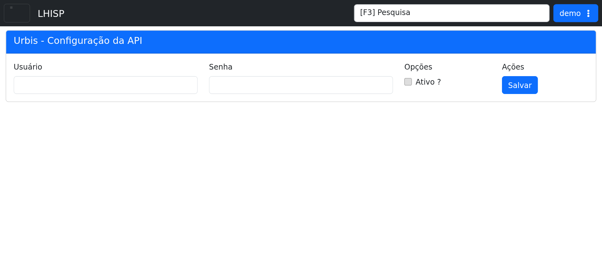

# Urbis

## Objetivo

Configurar a integração com Urbis e acompanhar o estado de ativação da API.

## Quando usar

Use esta tela quando for necessário informar credenciais de acesso, habilitar a integração ou revisar sua configuração atual.

## Pré-requisitos

- Acesso ao menu **Sistema > Integrações > Urbis**.
- Permissão para editar a integração.

## Passo a passo

1. Acesse **Sistema > Integrações > Urbis**.
2. Informe o **Usuário**.
3. Informe a **Senha**.
4. Verifique se a opção **Ativo ?** está conforme o cenário desejado.
5. Clique em **Salvar** para persistir as alterações.

## Campos importantes

| Campo / ação | Descrição |
|---|---|
| **Usuário** | Conta usada para autenticação. |
| **Senha** | Senha associada ao usuário de integração. |
| **Ativo ?** | Habilita ou desabilita a integração. |
| **Salvar** | Grava a configuração atual. |

## Resultado esperado

- A integração fica salva com os dados de autenticação.
- A opção de ativação reflete o estado desejado.

## Problemas comuns

| Problema | Como tratar |
|---|---|
| Usuário ou senha vazios | Preencher os campos antes de salvar. |
| Integração desativada | Marcar a opção **Ativo ?** quando necessário. |
| Falha ao salvar | Verificar permissão e dados informados. |

## Observações

- A tela do demo exibe apenas os campos mínimos de configuração.
- O campo de ativação aparece como **Ativo ?** na interface.
- A captura desta página foi feita no ambiente de demonstração.

## Dúvidas para revisão

- Existe algum token adicional para a integração Urbis?
- O campo **Ativo ?** vem desmarcado por padrão no ambiente produtivo?

## Screenshots sugeridos

- `docs/assets/screenshots/sistema/urbis.png` — captura limpa da tela Urbis no demo.

