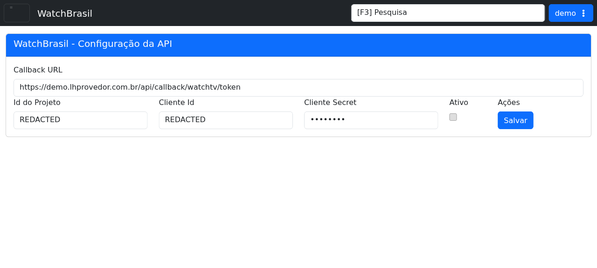

# Watch Brasil

!!! warning "Rascunho gerado por agente"
    Este documento foi produzido a partir da exploração da wiki do LHISP e da tela equivalente no ambiente de demonstração. Os dados sensíveis exibidos no demo foram redigidos na captura desta documentação.

## Objetivo

Configurar a integração com **Watch Brasil** para gerar a URL de callback, informar os dados do projeto e habilitar o serviço nos planos.

## Quando usar

Use este fluxo quando for necessário:

- obter a URL de retorno para a Watch Brasil;
- informar `Id do Projeto`, `Cliente Id` e `Cliente Secret`;
- habilitar a integração;
- liberar recursos da Watch Brasil nos planos.

## Pré-requisitos

- Acesso ao menu **Sistema > Integrações > Watch Brasil** no demo.
- Credenciais fornecidas pela Watch Brasil.
- Permissão para editar planos em **Cadastros > Financeiro > Planos**.

## Passo a passo

1. Acesse **Sistema > Integrações > Watch Brasil**.
2. Copie a **Callback URL** gerada pelo LHISP.
3. Informe os dados de integração recebidos da Watch Brasil.
4. Marque **Ativo** quando a integração estiver pronta.
5. Clique em **Salvar**.
6. Vá em **Cadastros > Financeiro > Planos**.
7. Selecione o plano desejado ou crie um novo.
8. Adicione o gateway **OTT: Watch Brasil** e selecione os recursos desejados.

## Campos importantes

| Campo / ação | Descrição |
|---|---|
| **Callback URL** | Endereço de retorno para comunicação entre os sistemas. |
| **Id do Projeto** | Identificador do projeto usado pela Watch Brasil. |
| **Cliente Id** | Identificador de autenticação do cliente. |
| **Cliente Secret** | Segredo de autenticação do cliente. |
| **Ativo** | Liga ou desliga a integração. |
| **Salvar** | Persiste a configuração. |

## Resultado esperado

- A URL de callback fica pronta para ser informada ao suporte da Watch Brasil.
- A integração passa a estar configurada no LHISP.
- O plano recebe o gateway OTT adequado para liberar o serviço.

## Problemas comuns

| Problema | Como tratar |
|---|---|
| A callback não funciona | Confirme se a URL foi copiada corretamente e se foi repassada ao suporte da Watch Brasil. |
| O cliente secret não é aceito | Revise os dados de integração fornecidos pela operadora. |
| O plano não libera o serviço | Verifique se o gateway **OTT: Watch Brasil** foi adicionado ao plano. |
| A integração não fica ativa | Confirme se a opção **Ativo** foi marcada antes de salvar. |

## Observações

- A wiki nomeia a página como **Watch Tv**.
- No demo, a tela equivalente aparece como **WatchBrasil - Configuração da API**.
- A captura usada nesta página foi redigida para ocultar `Id do Projeto`, `Cliente Id` e `Cliente Secret`.
- A wiki orienta usar a URL de callback `https://Seu-Provedor.lhprovedor.com.br/api/callback/watchtv/token`.
- A captura usada nesta página veio do ambiente de demonstração, não da wiki.

## Dúvidas para revisão

- Os recursos do plano precisam de uma página própria com a lista de opções?
- Existe algum campo adicional que deva ser documentado além dos visíveis na tela?

## Screenshots sugeridos

- Tela **WatchBrasil - Configuração da API** no demo: `docs/assets/screenshots/sistema/watch-brasil.png`

